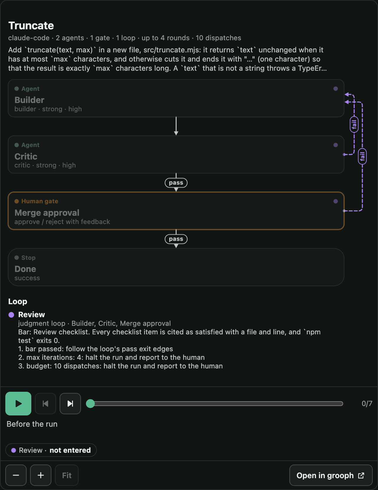

# grooph 💮

<picture>
  <source media="(prefers-reduced-motion: reduce)" srcset="docs/assets/readme-grooph.png">
  
</picture>

[View the animation](https://raw.githubusercontent.com/ryanjosephkamp/grooph/main/docs/assets/readme-grooph.gif) · [View the still picture](docs/assets/readme-grooph.png)

[Website](https://ryanjosephkamp.github.io/grooph/) · [Docs](https://ryanjosephkamp.github.io/grooph/docs/) · [Report a bug or suggest a feature](https://github.com/ryanjosephkamp/grooph/issues)

**Loop graphs for coding agents.** You, or an agent working with you, draw who builds, who checks, where a person decides and when the work stops.
grooph checks that every loop names a stop and every bar names what a critic can inspect, then compiles the graph into a prompt package for Claude Code.
Your harness runs the package. grooph never runs an agent, never calls a model, and keeps your graphs on your device.

**Open the app:** [ryanjosephkamp.github.io/grooph](https://ryanjosephkamp.github.io/grooph/). It is built for a phone's screen, needs no account, and opens offline once it has been opened online.

## Quickstart

You need Node 22 or later, pnpm and git. This makes a graph from a template, checks it, draws it, and writes the package Claude Code runs:

```bash
git clone https://github.com/ryanjosephkamp/grooph.git && cd grooph
pnpm install && pnpm -r build && scripts/install-local.sh
grooph template use grind-loop --name "Fix the flaky test" --set task="make the checkout test pass ten times in a row" --set test-command="pnpm test checkout" --out flaky.grooph.json
grooph validate --for-export flaky.grooph.json
grooph image flaky.grooph.json --out flaky.png
grooph export flaky.grooph.json --target claude-code --into .
```

`scripts/install-local.sh` links `grooph` into `~/.local/bin` and the `grooph-design` skill into `~/.claude/skills/`. It prints what it will touch first, and `--uninstall` removes both links. `grooph export` prints the kickoff prompt to paste into a Claude Code session opened in that folder. Run it in your own project with `--into <your project>`.

## Ask your agent

With grooph installed, describe the work to Claude Code:

```text
/grooph-design a builder and a critic that loop until the checkout tests pass, and ask me before merging
```

The session proposes one to three validated graphs, from the templates or from scratch. It gives you a link that opens a side-by-side comparison on your phone, and it places the package you pick. The skill tells the session not to start the run until you say so. You can also install the skill as a plugin: [`plugins/grooph/README.md`](plugins/grooph/README.md).

## What it is not

It is not an automation canvas with connectors, and it is not a hosted studio that executes the graph. It does not replace your harness, your editor or git. Claude Code is the compile target the built-in templates have been run on. A second target, Codex, compiles and is tested against golden packages; no run of a package in Codex is on record yet.

## Status

Early, version 0.3.0. Each of the twenty templates has a recorded run: eighteen pass the project's checks and two are published red. In those runs a session stopped where its graph said, at a passed bar or at a human gate, and left a record of what it did. No round cap or budget is on record as firing, so it is not shown that one holds a run that would otherwise go on. In a paired comparison on four small tasks the package showed no quality advantage over a prompt derived from it. [`docs/claims.md`](docs/claims.md) lists every claim, its evidence and its audit. [`docs/PROGRESS.md`](docs/PROGRESS.md) says where things stand, and [`docs/PLAN.md`](docs/PLAN.md) has the staged plan.

## Docs

The same documents as pages: [ryanjosephkamp.github.io/grooph/docs/](https://ryanjosephkamp.github.io/grooph/docs/).

- **What grooph claims, and on what evidence**: every claim, where it is made, and where its audit by a second harness stands: [`docs/claims.md`](docs/claims.md).
- **Quickstart**: [`docs/quickstart.md`](docs/quickstart.md). **Every rule, by its code**, with a document that fires it: [`docs/rules.md`](docs/rules.md).
- **The field guide**: all twenty loop shapes, each with its picture, when to use it and what its recorded run showed, and [a one-page poster](docs/field-guide/poster.svg): [`docs/field-guide.md`](docs/field-guide.md).
- **The graph document**, its schema and every validation rule with its code: [`docs/graph-ir.md`](docs/graph-ir.md).
- **Templates and the pattern library**, twenty named loop shapes (grind loop, review gate, spec then loop, metric sandwich, …): [`docs/templates.md`](docs/templates.md), [`patterns/`](patterns/).
- **The Claude Code target**, what a package holds and how a session runs it: [`docs/targets/`](docs/targets/).
- **Proposals and share links**, which the `/grooph-design` skill uses: [`docs/executive.md`](docs/executive.md).
- **Runs**, including run folders, notes back onto the graph, and the monitor: [`docs/runs.md`](docs/runs.md).
- **Things to keep**: the picture, the outline and the one-file offline page. **Embedding**: one line of HTML that shows a live graph, or a recorded run that plays, on any page (`grooph embed`). See [`docs/exports.md`](docs/exports.md).
- **Operation maps**, for work that spans sessions, harnesses and accounts. They are drawn and checked, never run: [`docs/operation-map.md`](docs/operation-map.md).
- **The live view of subagents**, from a hook that records ids, names, times and its own machine's paths, never content, and returns no decision to the harness: [`docs/subagents.md`](docs/subagents.md).
- **Community**: loop graphs sent in by pull request, checked and drawn by CI: [`community/`](community/README.md), [`docs/community.md`](docs/community.md).
- **The product contract**: [`spec/capability-spec.md`](spec/capability-spec.md) with [`spec/AMENDMENTS.md`](spec/AMENDMENTS.md).

Agents entering this repository start at [`AGENTS.md`](AGENTS.md).

The picture at the top is the review gate template's recorded run, replayed step by step by the same embed that plays it on any page. `node scripts/readme-picture.mjs` makes it and its still.

## License and author

MIT licensed; see [LICENSE](LICENSE). The site's Atkinson Hyperlegible Next and Mono fonts retain their SIL Open Font License notices in `apps/web/public/assets/fonts/`.

Created by **[Ryan Kamp](https://github.com/ryanjosephkamp/)**. grooph and all its features are free. Optional support never unlocks features or changes functionality.
