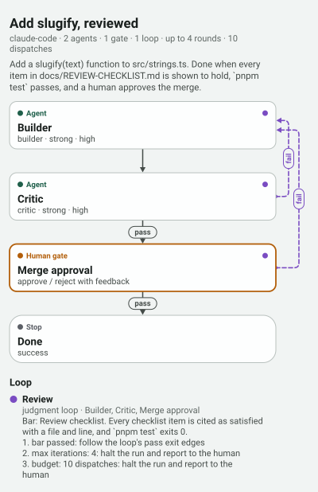

<p align="center">
  <picture>
    <source media="(prefers-color-scheme: dark)" srcset="docs/assets/review-gate-dark.svg" />
    
  </picture>
</p>

# grooph 💮

**Loop graphs for coding agents.** You, or an agent working with you, draw who builds, who checks, where a person decides and when the work stops.
grooph checks that every loop can end and every critic can actually inspect something, then compiles the graph into a prompt package for Claude Code.
Your harness runs the package. grooph never runs an agent, never calls a model, and keeps your graphs on your device.

**Open the app:** [ryanjosephkamp.github.io/grooph](https://ryanjosephkamp.github.io/grooph/). It works on a phone, needs no account, and opens offline once it has been opened online.

## Quickstart

You need Node 22 or later, pnpm and git. This makes a graph from a template, checks it, draws it, and writes the package Claude Code runs:

```bash
git clone https://github.com/ryanjosephkamp/grooph.git && cd grooph
pnpm install && pnpm -r build && scripts/install-local.sh
grooph template use grind-loop --name "Fix the flaky test" --set task="make the checkout test pass ten times in a row" --set test-command="pnpm test checkout" --out flaky.grooph.json
grooph validate --for-export flaky.grooph.json
grooph image flaky.grooph.json --out flaky.png
grooph export flaky.grooph.json --target claude-code --into .
```

`scripts/install-local.sh` links `grooph` into `~/.local/bin` and the `grooph-design` skill into `~/.claude/skills/`. It prints what it will touch first, and `--uninstall` removes both links. `grooph export` prints the kickoff prompt to paste into a Claude Code session opened in that folder. Run it in your own project with `--into <your project>`.

## Ask your agent

With grooph installed, describe the work to Claude Code:

```text
/grooph-design a builder and a critic that loop until the checkout tests pass, and ask me before merging
```

The session proposes one to three validated graphs, from the templates or from scratch. It gives you a link that opens a side-by-side comparison on your phone, and it places the package you pick. It does not start the run until you say so. You can also install the skill as a plugin: [`plugins/grooph/README.md`](plugins/grooph/README.md).

## What it is not

It is not an automation canvas with connectors, and it is not a hosted studio that executes the graph. It does not replace your harness, your editor or git. Claude Code is the only compile target today. The Codex target is planned.

## Status

Early, version 0.2.5. Twenty templates have each been proven in a recorded run, and one paired comparison has been made. On that evidence, grooph is shown to bound and record autonomous work and to hold a design as a runtime contract. It is not shown to raise quality over the same instructions given as a prompt, on small tasks ([decision 0013](docs/decisions/0013-value-as-of-study-one.md)). [`docs/PROGRESS.md`](docs/PROGRESS.md) says where things stand, and [`docs/PLAN.md`](docs/PLAN.md) has the staged plan.

## Docs

- **The graph document**, its schema and every validation rule with its code: [`docs/graph-ir.md`](docs/graph-ir.md).
- **Templates and the pattern library**, twenty named loop shapes (grind loop, review gate, spec then loop, metric sandwich, …): [`docs/templates.md`](docs/templates.md), [`patterns/`](patterns/).
- **The Claude Code target**, what a package holds and how a session runs it: [`docs/targets/`](docs/targets/).
- **Proposals and share links**, which the `/grooph-design` skill uses: [`docs/executive.md`](docs/executive.md).
- **Runs**, including run folders, notes back onto the graph, and the monitor: [`docs/runs.md`](docs/runs.md).
- **Things to keep**: the picture, the outline and the one-file offline page. See [`docs/exports.md`](docs/exports.md).
- **Operation maps**, for work that spans sessions, harnesses and accounts. They are drawn and checked, never run: [`docs/operation-map.md`](docs/operation-map.md).
- **The live view of subagents**, from a hook that records ids, names and times, never content, and cannot steer: [`docs/subagents.md`](docs/subagents.md).
- **The product contract**: [`spec/capability-spec.md`](spec/capability-spec.md) with [`spec/AMENDMENTS.md`](spec/AMENDMENTS.md).

Agents entering this repository start at [`AGENTS.md`](AGENTS.md). MIT licensed.
