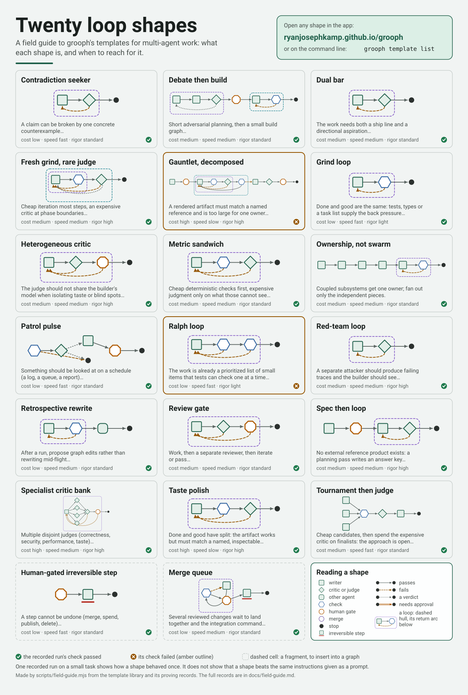
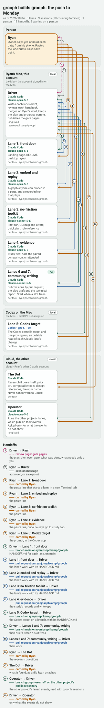

# Loop graphs: draw the loop your agents run, and make sure it can end

*A draft for Ryan to edit. Written in his voice from the project's own records; every number here has a file behind it. The two live graphs below are `<iframe>` lines; GitHub's own view of this file does not show them, and the site's page does.*

I run a lot of coding agents. Some days a dozen at once, on two accounts, in the cloud and on my Mac. The work itself goes well. What goes badly is everything around it: a loop that never ends, a loop that ends somewhere I did not choose, an agent that reviews its own work and finds it good, and my not knowing, at seven in the morning, what is running.

So I built a small tool for the part around the work. It is called **grooph**, it is open source, and it does three things: it lets you **draw** the loop, it **checks** that the loop can end, and it hands the drawing to the harness you already use. It never runs an agent itself.

## What a loop graph is

Here is one. A builder writes the change. A critic, in a context of its own, reads it against a checklist. If the critic says no, the builder goes again. If it says yes, a person approves the merge. The loop turns at most four times and may send out at most ten pieces of work.

<picture>
  <source media="(prefers-color-scheme: dark)" srcset="../assets/review-gate-dark.svg">
  
</picture>

The same graph, live. Drag it, pinch or ctrl-scroll to zoom, and tap a node to read its brief. This is one line of HTML, printed by `grooph embed`:

<iframe src="https://ryanjosephkamp.github.io/grooph/#/embed?d=rVdNb9w2EP0rhC5NAGkTAz2tD63jGE2_gSRID4WB0OJIYiyRAknZXqT-731DUh_r2kkL9GJL4nA48-a9Ge7n4qbYn5TFtTaq2Betk2NXlIWydbH_jFdr8b5_WRaal6VSle-nVjeHytGNpltSsDZyIKyeKSXyaik2yzfkvLYmntNa2WdTORs_C3QXnotmMnWAnQhWeFe_8MFp0_pd8CJ0Moje3pKrpSdfCl4bvZB1TQbr0ijxyWrjxa11Cn916ITH7p5Edxg7Mn4nXltD4hbPghDRQehAg9BGIFf_4u3Fhx8v_qjO31yc__zLj-_e7wYltBe-s7cxoM72qhQfRzMOIpAPH8UofQyFz5aimwZphBxHZ2-IAyYxkGtph_yDxENgPDvpDHkPAOpeToqq2ioq7sui14ZkS2wzyhDIAa0iQVi1MhC8NM4Oxx-_P-GtinwNMEJEuDgTV5PuFTmhh7GnIcLD0QTpr3fiTMA26JrzlqJx5DtRW8MFEHVH9XUyVrppYmKcqrBTGKcgZCuBMP6LW_gIwDHu6LUPp6KRup_gDnUPk4uQsaM5mFiQhDGQnUFjCEVrGS-7YBhhE5xfiWpZT3D5iRIzZO9tPsE_OGIn3uOlB19BDgtuxEpHA-nWYgWUHUHaCQHUciyFdfNHpT2wrzt4VKjXTrzKwXOwGTaPChJCDZoch6dhzmfcyF4rGeCs6WXrT0VHKKJtyZCdfDWDntD1kAt7Ginhwt-yBedoLD64eASzx4AiYMyfn5MEc7rFIlnQxoRVhK-WdWd7OtowwFPPFGPXWIGIrGmZQ9Q01oGhRadblv-V09Tg9bVduMOMiYHCSZnjBjmgq9-ZSj3q5RKurH2p1mqLRjumDZdcKXDEC5LArUH8kGgsgZcHoMmahBzBB2DAYuoPO_F2SgdHKtZ2GNjRFSFgEgc74bARsSdKKRt3Jo3wqhOsXzSFa2w5WGY0WgnDqg04zbgWc4ap7T3aCrC0pvOMlZgpdIKKPS8uyyJpZPFXd9K0RzjBxfmbs99-uHgHH3skK0O24pj0zEnOItEqw-MZk4wbeICjZI9OyAcxzFWje2LnpHRYXtxkqnTq5X2ZiZMY9iRvzuflTJvF_L-z5ifWj1hhWDpH-pR7BuqOfsyNT4zcrtCNS1HjUNNGQ84lwhFN4gTwMmjfaIqYJNawNV6A32QGQiOafDqaaeE1FHnAOf2BuwXwxSQKCWIZthEGOyEw_wTbmEie-kY4maSJTSK4ycdgZabgaaTjJ06-jI-ZjY2-24kP5JSuQ2p5MaCHk4gnTJpk8_k-Wp9CebG9VGC1IlPT2tpinwYQC6joaYbPvKIowmOiJ-tmkzcPp2OspN_C0pO8iWgnTVcc-JdkciyERTL741Kv0cbE0yy4yQCxVboz8Os-AfZXnC_49xCKp_XAM4qqOZojSfDMNAfesRHNKpQ4gOapm8USR9P8LSvm1zio0sjHpaYs8DCMrIf3a0OPg0d9VQw7kbzp8B0c2TjNI4b5RsEJxCmYOkpDpK5kfb2JWlmziZdH4Brp67QGMMBo_uAnXJxwD7m_5MbRbucLVXlgVEsHyDePdZAEu20QSy3-T4rlOwdcLVeuLxJvwYFy3BUzZg1-iTbGvqbCUsKHbLxNZWHvY865rE85P-JP9h_tN25WmyoXLrs62hzd5fWvO0oE-ZKrf5M2lyay_Ru_pRmIwnerDVHSkF1J9nZ-H2i4Qp9lZ-uB6zhZo4LP6J2F-KBqjyV2mWYRjuIeO6Tphcsdz6ajGFZZxfbnR-xOgWd1bNddHFlPEouhngemC7qR9brpMY4yUPyrZMSYYUCLi9jhH7Q8jCtMOvQFaGEeaipJWx4PvnSv2f7uoDu-rL7c8QSON91tZoCjSi1nG_kg7yoch-kV2wpKVuy_3aynC28sjvS4xTMg-TIce2mvB42-dvLyPhJhtL2u9bZpjHP5tLd9PGVtRY-s-NqOtPzaXNg8VsZWPGcrLPDdZ3Xyz4UHPi7v7_8G" title="Add slugify, reviewed, a grooph picture" width="100%" height="620" style="border:0;width:100%;max-width:100%;display:block" loading="lazy" referrerpolicy="no-referrer" data-grooph-embed></iframe>

That is the whole notation. Boxes are agents. Diamonds are checks a machine can run. The orange box is a person. A dashed line that curls back is a loop, and every loop carries its **stops**, in order: what ends it, and what happens then.

The graph is one small JSON file. A model can read it and rewrite it in one pass. It diffs. It has a version.

## What grooph checks

Before a graph may be exported, the validator has to pass it. It refuses, with a code and a sentence saying what to fix:

- a loop with no stop;
- a loop that polishes to taste with no bar that says "good enough";
- a critic that shares the builder's context, and so can only agree with it;
- two agents that own the same file;
- a step that cannot be undone (a merge, a publish, a payment) with no person in front of it.

There are 35 rules in all, each with a failing example in the repository. None of them is clever. They are the mistakes I kept making.

`grooph explain` says the result in plain words:

```
Loop "Review": at most 4 rounds.
  stops when the acceptance bar is met, the loop is left by its pass edges
  stops after 4 rounds, the run halts and reports to a person
  stops at 10 dispatches, the run halts and reports to a person

Human gates:
  Merge approval: The critic passed the change against the checklist. Merge it? (before Done, Builder)

Worst case: at most 4 rounds of looping in all (nested loops multiplied); budgets: 10 dispatches; 1 place where a person must say go.
```

## What it hands your harness

`grooph export` turns the graph into a package in the harness's own units. For Claude Code that is a lead brief, one subagent per agent in the graph, the loop's policy, the list of gates, and a contract for the notes the run must leave. You start a session, point it at the package, and the session runs the graph. Your harness does the work. grooph is not there when it happens.

Most of the time I do not draw the graph myself. I ask my agent to: `/grooph-design a builder and a critic that loop until the checkout tests pass, and ask me before merging`. It proposes two or three graphs, I pick one on my phone, and it places the package.

## What I measured, and what I did not find

I want to be exact here, because it is the part people skip.

[](../field-guide.md)

**Twenty templates, twenty recorded runs.** Every template in the library has been run for real, at least once, on a small task built so its point could show, and the record is in the repository: what ran, which stop ended it, what it cost. Eighteen of the twenty pass their check today and two do not, and the two are published red with their reasons. The [field guide](../field-guide.md) has every one.

**One paired comparison.** Four templates. For each, three arms under the same conditions: the graph's package; the same design written out as one prompt; and that prompt in a plain retry loop. A held-out test suite scored each run, and a blind judge ranked them.

**The graph did not win.** On every project every arm reached the same held-out score. The judge never ranked a graph run first. On the simplest project the graph cost about twice what the prompt cost, for the same result. The prompt had kept the design (the roles, the routing, the loop) and a strong model followed it.

**Where the arms differed, it was in stopping.** One prompt run kept attacking its own work until it hit the $9.00 ceiling, at $9.02 and almost 25 minutes. Both graph runs of the same project stopped by the graph's own edge, for $2.63 and $3.57.

Here is one of the twenty recorded runs, as it happened. Press play: the critic fails the first round, the builder goes again, the bar passes, and the run stops at the human gate before anything is merged.

<iframe src="https://ryanjosephkamp.github.io/grooph/#/embed?d=7Vvbchu5Ef0V1OxDSNUMxaEkX6iHxLGVvWTXSdnOuuLIVYRmQBKrmcHUANSlbFflKR-Qyr_kPZ-yX5LTAObGi2w5yhtr1zY5AHoa3af7dEPQh-AqmMZhcCmLNJgG1aoIwiBVSTD9ECwqpcrlKzyajkM7NA0m48mj8dPJOIqfTk6OnmByWalFJbTG4DcMk9naFPaff7OSV1pE6ariRqriHP8dHHyreDY6OGDP0pTN7IQXfnxgxI0ZzphRTFfJYb1slP-iQ2aWgsniSmA-U3M2m6sq5-a1SFSR6lnIrqVZMiO00ZjmPrQS6CuJYbxI2auzZy9-OmPYrB6xF6oQ7HopCiYg-5ZJI3ISQKOHr85-_v7sbfT8u7Pnf_zx-9dvRnnKlipLoc6sKHP7lhk2qbXAI5LN2XKV84LxEua5EtqqnYtqIUZu9z_CtGxWiSsprmdTmKFSK6yL2WAuC6mXIh2S4VKpS26SJSQcs0MWj-lhzm9IP7cnGsAzbSBvLiuRTtnBwQWvnDopJHNTC6dXf_MNe6lSoenzR1bgI_uI1dysNPuIR1EU2T80erGSWSoqTHACxjAHzDTQppKJYYuK5zmvTlltAxYfH8bHVvF6O26Bn8kqkfEbkbISQp1RYcru-seH8eOh1YMllTQyad9N-5pzmWFHv_79X85Bj9iqyIVhgyeHxzFbiiyN1MqwhMMRXTVoLdnDr-VZhqUkQbME_2yoELayjmMSbTWy_osW3JDJDg6WPMNSK_CaQ9diwQBG62nrfLxs4P3Pzs-xD_GLgNUsQOdCpBc8ufR7tVb6CLMUKYn56B311omlb99ZOKUikRpOJ5_OWnVmU_tWbzHnePdkyYuFYHzBZYG9uUciucwk4oD9RAJght-eF1GNVPbrP_7JZiJqhUek3Mw9tx9p9ra9bFnqpvnFHk0zNnBemQxpY8-dinggCB8UD2xwrapLMoSphAgxlqg8lwbWHk43UgIbFOJ6GO4MdT_sop0id5CrVM4lhIXs-XfPXn579to-xrywhvxvtIdOphZ2sceqn-UsXU-KYq_4cMTOrmQqikTY5LOUGpAgeVM3czzCm-eh_xIBdJHV09wY_zDuzoh7M0YeFT9yuNLGu_UlPX02N2S9OoVQBo7GT6PJ-E38dHp0ND2avIPlYtbmBQvbg4NbQTExcDmvgYYLLhsZ3sUyE9NMFqKX8MSNNGw8tN41Sl2S851lInrJbMReQ0vNJjD5Wsoa2ix5xAYXq3SBAI4hplBIVIJDi7Te6rMcEYE_xqarl0AfRsA5Wq2qRLQcZQlKEoH1mQZTC55jYvBnes46z4lB6BOR3wJUhDl3MhFn8Lw1xL1JaYqtM7OqsHHeqMD0Klkyrtl5EC-Pxvl5EOLj8Yk-DxiyyHlwMh7n9EUW7u2r_AI-hnTtxI7YXwoJluMV8k3I8pA5WsuhjwUfcoSqgL2QkVEpZeQKvlVA5ylm3gKeCDGRQWezrNQ1afeKgvGsqlRV81ihiojyPUVjPevNbekmjdgby7QLdQfZjtizNp1qOBt7sBmaAESr8Vwjaly8IAvZ1EJvx2STYd417cWOkj9YJjhRqkK6PO0mvl8IS7rJdtK4PcD4WEnougVsNDkTMEu_gvMhRi_VdUEiiP-_hv4BPcPxwRB6l7wqXOmUZHyVInzAx8GnMKBY4wuLcPA_Aodqr6XAB7UQhVAr7SMN4uaVyneM_i4mYWB7fC0t8KfBG6ji0pWjMr3kpfBlU2tLVdhvkF0YCdzZv2hr9LSuC_wkwEMRPDBlxN5KwhUj0_rdsQtFsjHqwEpDSMEiY3Oey-wWwFXOu1e8kjBWwkt-ITNpMERu88aAr6sVKai0jtxS63KCZgEOImR67VGrFvQYinAfL7U2qBCXksKhqiR5xm48XfEsqtWlmkhTkYN3sjgeksvss2D6tw8uy3gDBE3djKmFabPN75vxSmWit8DunPxKBsGIMx65ScyRNgx5Ui6WmHkBY8zx9YWyVjZcX7rAhg0gpFvqjtifaKcZb2ggtBjvEBdqQ-2iiqcp1esuK6DapJIjpJyj-S2MQ3GAEBAuZIDg7HZk63qrBJVIxMYk6EJAYUFRhZeV0N2BP1U-lVsup5hjFDPE6VhyqyyIuCGzyqJE7MOuQb1D131sDT8MdXiYUN8wniqGwfswQCLpynPVT9dOENEy_tTlFTcrdQh0AmkXDiXePJps4u0GHOBVKCHVNb2IzBwRLZBwkUrTfAEII_fW959CD5wmaLfj5nk93A9ZWF9TsIE9UByICmtcQFojrEVkuapKpcWI_QEubSLCzuTwyxKz-tFXiWiptE-wtiFQm2Hj8uSWOLE5fC1aPOibza5jvs4qd6H-B0rmny1iQ5tNKEHYnoIyeEiFi6Mr4fia3GmnWE7UYCc9pzwjjUe9TRWWJWw7ccpW2r2aYK2lUSAHVSDdIO_bQhW7tRDhpquhUSvq1HZEiyUfkc0Z6JGcAGUKymjaKst9CI3YXxFOlslObWT5aJrLmxH7WVQpNV5ENU6hdfayXWmTp10bTLNPqTzhmUwjUReodinNIkyRIdryL-EFvfNCOKLsBaqbPe_smxitbyuuu2bxdE10bIOFFL8rzPuB3IT8tO_qtWLVse6VNxDNcjUefZ06g31k1D7in3VT7I7nayBYRLU2vZCmGC1uaUUn6NtAb5ugNthtTVA_8xHvejBXJ6AItccpeWk8T391RwdBymYPa0NfhtAGtvRtHa2pv2v1pR6j1fSFG4MxgGh6gAI2oeLl03tKfIsuP4rIJ6SNKqUlQqO6KaLxxUNCzDmORNVl2p24a8zQtDEEmFb3RlmrersTiiTKam5ydycNeLcJJ6_uEt6Dj5dv53fErLXorajeYivOj39ekMPHXaK-ZNvNEQg65A7KgJMM3VoHJ65GaDH2qv6eC-p2LHjbF7Z80moFmVY6xeGa17Zt7L0jI7yKUmzuyBddMZFTT4c2qmz20yVWO8V9cHTHK8tYO4FFpq75vjJyzpN20RaIkp04QqsEyZA9g7Nt3bn0R1cUCTWl-W6d92nPVWVrfbtm4xHRL8V4b18wRuTyTVdv9O9R27-Tw4LpcWfctfHWNVyvKtK6PboMqJ_JJZJaPP5kYVCqTCaymzHK2nlSq6zu0WtTb47oBN0fhhYVR_ffYLmMChURyUYYoMKtFbI5sCYDERr4c6f9wcL-YGF_sLA_WNgfLOwPFvYHC_uDhf3Bwv5gYX-wsD9Y2B8s7A8W9gcL-4OF-x8sgPW6ShXReDyOg92X6rhp1pMp4V2R-ontxY7JyfToyTuKHzSv7vIeq-c2mttXTT73Kiq5pm1A3PHGk_G7frL2U6k4W5FBxo0-de3YOGxdraOHVkughtoy_HhDa58iW5UTFKoUqztgxnPMJJx92tgdqnfEx5ajm-2HFvVNJCqDaaB7B6l3k87VFmNbW5zaK2t0LsFKJQsEGRoGlV0Rd9Ohw5zqyvpaXue8qHdcNFyz_vEXWb_JjTuN__g-mPCFRwsJ6gncLapxzcl9NU8eWM0dGMH_x_1d-Gzva732QbunLjV17nfVc_oXvO5uQJtzrBowkT3J6lxjO479vUbimnvAdcFL17hSm9895iJp9tAC7yh54vL6vOKJu6PlTsFqlCfo5IRHWud2pF5hNfK-ZTHmyIX08952Vyzj6ITZ7qd7Z3PKttzZdCeBncNCNliVJVV7GMU60EtP4wthroUoDrlrr0u4HhPolmTOs3Yvw1HnvIJKbyOK0RrMHn0OZlRhTJu64r4ounemmbSZpr58W98MPrW3_7QjbkQQnYpV9pIh3e-jBsvX9YOuwYenmxeHO1fu6GbjTXNTeEietzfzJofxuHMNecTecHs1s1cUURaqkUJ3YL2UdRs_fqh8v2nmjZQT30FDrpppa-i-lk8eWsvtWDmaTMeP7mKl-H9hpfqmdX3zunfjmg0oniJUn6JA2yOvmtgCg-S5cAdV4BlBJVtlOiG3LbpCdomwZ1RCYqnNETzTp_6UoHPVflWmfP22dZ_mOvdxK-Ejdc09Tx-GD7aY_w4M3UFb8VbaiscPrOYOENm7vdtA1NLWBqo2aCvu0Vb8f6ItVMG12yv0TShWL279QcQ9Kc07xV3j77cveuu15Q7i3KVlNvDIC_FZX0qQTHpoVKqQ-Nau_tOsLn80uFzLbnH8EAyy26Gt_-zxSa-h-mLrHa-zSvyFrFIzSudI0Bo6XLfs0N4sp99E0RuEY8_2Ha30mOe4zzHDTZKxSQIk0zbe69b_shand-ywM-Y2fUC_67EtL_jfAeHG_1zO_uCrfcnX_F4Gan19WR8zO6n0c1r_6xlEru6orfnJH3WYn_4L&amp;play=1" title="Parse duration (a run), a grooph picture" width="100%" height="760" style="border:0;width:100%;max-width:100%;display:block" loading="lazy" referrerpolicy="no-referrer" data-grooph-embed></iframe>

So this is what I claim, and all I claim:

> grooph is shown to bound and record autonomous work, and to hold a design as a contract while it runs. It is not shown to raise quality over the same instructions given as a prompt, on small tasks.

A second study, on tasks built so a first pass fails and the loop has to turn, is designed and has not run yet. If it says the same thing, I will keep saying this.

## Seeing what is running

The other half of the problem is sight. grooph installs a hook in the harness that appends one line to a file when a session or a subagent starts or stops: an id, a name, a time. Never a prompt, a file name, or a reply. From those lines it draws what is running now.

For work that spans sessions there is a second, smaller drawing: an **operation map**. Sessions, the people they work with, and what carries work between them (a branch, a pull request, a message, a person). Here is the map of the two days in which the newest parts were built: one session driving, others building in parallel, and me.



grooph's summary of that map is one line: *9 sessions, 19 handoffs, 9 of them waiting on a person.* That person was me. Nearly half of what moved in my own operation moved only when I carried it. I would not have guessed that, and seeing it is what the map is for.

### A hook that may not speak must still leave a trace

One story from this, because it changed the design.

The hook is built to be silent. It prints nothing and never fails a turn, so that watching can never change what an agent does. I added a second hook that sends those lines to a branch of their own at the end of each turn, so another machine can read them.

The first time it ran in a cloud session, nothing arrived, and nothing said why. A cloud session starts with no branch checked out; the sender had no name for its branch, stopped, and stayed silent as designed. Three turns were lost without a sign.

The fix was not to make it louder. It still says nothing to the session. It now writes how each push went into a small file beside the events, and one command reads it. Silent is not the same as traceless. I had built the first and forgotten the second.

Since then the cloud sessions on another project of mine publish their events this way. On the first day five of them sent 163 lines: ids, tool names, times and a folder's name, and nothing else. Every line was read before I left it on.

## Try it

```bash
git clone https://github.com/ryanjosephkamp/grooph.git && cd grooph
pnpm install && pnpm -r build && scripts/install-local.sh
grooph template use grind-loop --name "Fix the flaky test" --set task="make the checkout test pass ten times in a row" --set test-command="pnpm test checkout" --out flaky.grooph.json
grooph validate --for-export flaky.grooph.json
grooph image flaky.grooph.json --out flaky.png
grooph export flaky.grooph.json --target claude-code --into .
```

Or open the app, which needs no install and keeps everything on your device: [ryanjosephkamp.github.io/grooph](https://ryanjosephkamp.github.io/grooph/).

It is MIT licensed and will stay open. If you draw a loop of your own, I would like to see it.

## What it is not

It is not a runtime, and it is not a hosted studio. It does not call a model. It will not make a weak plan strong. It is a drawing with a checker in front of it, and a record behind it.

<script>addEventListener("message",function(e){var d=e.data;if(e.origin!=="https://ryanjosephkamp.github.io"||!d||d.grooph!=="embed-height"||!(d.height>0))return;document.querySelectorAll("iframe[data-grooph-embed]").forEach(function(f){if(f.contentWindow===e.source)f.style.height=Math.min(d.height,4000)+"px"})})</script>
