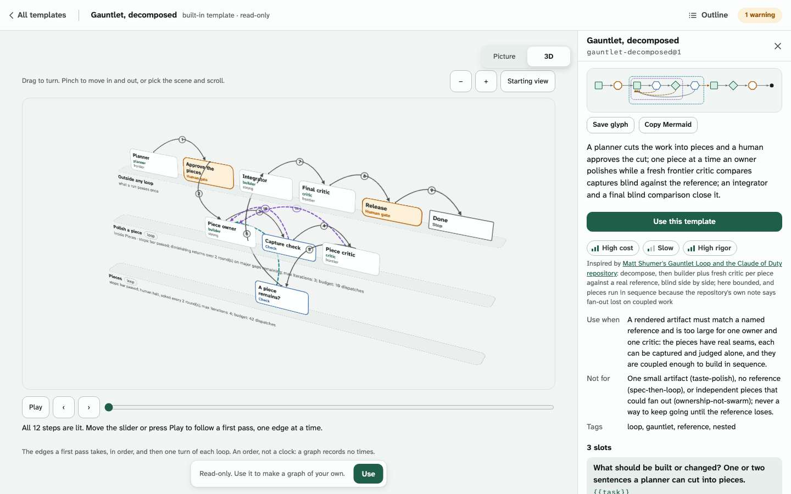
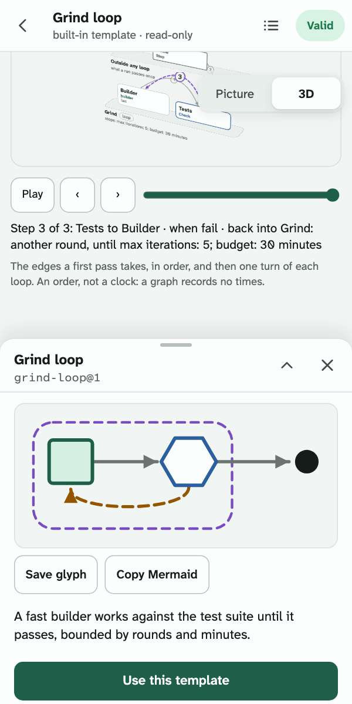

# Things to keep: the picture, the outline, the offline page

Three projections of a document, for reading and sending rather than editing. Each is made by core from a graph (`.grooph.json`) or an operation map (`.grooph-map.json`), the same way in the CLI and in the app, and none round-trips: edits happen in the document.

| | What it is | From the CLI | In the app |
|---|---|---|---|
| **Picture** | The whole document with its words on it, as SVG or PNG, light or dark, in one of six themes, laid out for a phone. An operation map has two more views: its lanes side by side, and a sequence | `grooph image <file> [--out x.svg \| x.png] [--theme <name>]`; for a map also `--layout wide` or `--view sequence` | Export → Keep a copy → Picture (PNG), Picture (SVG); a map's other views are on its screen |
| **Outline** | The whole document to read top to bottom: every brief in full, each edge as a sentence, each loop with its bar and stops | `grooph outline <file> [--out x.md]` | the list button in the top bar |
| **Offline page** | One HTML file holding the picture, the outline, the validator's list and the document itself, with no network needed | `grooph page <file> --out x.html [--theme <name>]` | Export → Keep a copy → Offline page (.html) |

The read-only viewers (a link, a template, an operation map) have the same Keep a copy and outline.

## The picture

400 units wide, so at a phone's width one unit is about one pixel and the smallest text is about 10 px. A graph is one column in the order work reaches each node:

- a card per node: its kind, its name, and one line (an agent's role, tier and effort; a gate's answers; a check's command);
- an arrow to the very next card, with its condition in a pill;
- every other forward edge in the left margin, and every loop's back edge in the right, dashed in the loop's color, each on its own track so no line crosses a word;
- nodes of one rank in a tinted band, marked "side by side";
- below the cards, each loop: its kind and members, its bar, and its stops in order with what each does.

**A subgrooph is one box** (a template placed as a unit, [templates.md](templates.md) §2). Closed, which is how it is drawn unless asked otherwise, it is one card in the column: its name, the template and version it came from, how many nodes it holds, how many of them are human gates and how many loops are inside, the line a person wrote on it, an irreversible step inside if there is one, and the glyph of what it holds. An edge that crosses its boundary starts or ends at the card; what is wholly inside is not drawn, and a loop inside is counted on the card and left out of the list below. `grooph image --open <group>` (or `--open all`) draws it open: its nodes are the cards they always were, kept together in the column inside a dashed frame, with the box's name and its template above the first. A subgrooph inside another is a box in its turn, and stays out of sight while the one that holds it is closed. A plain group, one with no `from`, is not drawn. The picture of a graph with no subgrooph is byte for byte what it was.

This drawing is a piece of its own (`packages/core/src/picture/graph-units.ts`), like a map's other views: the web app fetches it only for a graph that has a subgrooph, and core's `picture` in Node has it already.

**On the canvas** a subgrooph is one box too (`apps/web/src/ui/canvas/units.tsx`). Closed, which is how a graph opens, the box lies over the place its nodes have and says what the picture's card says, with the glyph of what it holds; an edge that crossed its boundary reaches the box. A tap, or Enter on it, opens it in place: the box becomes a frame around its nodes, with its name and a Close button, and no other node moves, because every node keeps the position the document gives it whether its box is open or shut. A closed box does not drag: its nodes are moved with the box open, where each can be seen. A node a panel is about, or an issue points at, opens the boxes around it; a run's canvas shows every node's state, so its boxes are open. The outline folds a subgrooph's nodes into one box as well, shut until it is opened. The box is fetched only for a document that has a subgrooph, and the page names it so that it is held for a visit with no network.

An operation map's picture is described in [`operation-map.md`](operation-map.md) §4. A map has two more views, drawn by core from the same document and written by the same command:

| View | What it is | Good at | Loses |
|---|---|---|---|
| The picture (`grooph image <map>`) | Lanes top to bottom, 400 units wide, every arc in one margin | A phone; the cards in full; the live marks | A wide screen, where it is one narrow column; a long map, whose arcs cross often |
| Lanes side by side (`--layout wide`, §4c) | Each lane a column, the people across the top, arcs in the gutters between lanes | The shape of the operation across a wide screen, with few crossings and no line over a card | A phone: about 900 units for three lanes. The order of the handoffs. It is still tall when one lane is full |
| The sequence (`--view sequence`, §4d) | A column for each person and session, a row for each handoff in the map's order | Reading the handoffs one at a time, with what carries each and what is handed | The cards, the lanes' machines and accounts, the live marks; and it looks like a timeline, though the order is not a clock |

In the app a map's screen has a switch, Picture and Sequence, at every width, and from 1100 px the picture is drawn with its lanes side by side. Keep a copy still saves the phone's picture; the other two come from `grooph image`. In core the two are `mapWide(map)` and `mapSequence(map)`, behind a door of their own (`packages/core/src/picture/map-views.ts`): the web app fetches them when it first draws a map, and no other address carries them.

Light and dark: `--theme light` and `--theme dark` write the colors into the file, so it looks the same anywhere. `auto` (SVG only, and the SVG default) carries both and follows the viewer's color scheme. A PNG is light unless told dark, three pixels to the unit (1,200 px wide; `--scale` changes that).

Themes: the same picture has six looks, [`themes.md`](themes.md): `paper` (the default, and the picture as it has always been), `blueprint`, `ink`, `phosphor`, `transit` and `chalk`. `--theme <name>` draws one, and `--theme chalk-dark` draws one in light or dark only. A theme changes colors, line weights, lettering and the ground, and nothing else: the markup, the geometry and the words are Paper's. Without `--theme` the bytes are what they were before there were themes.

The SVG is deterministic: the same document and theme give the same bytes, and golden copies of two graphs and the sample map are under `fixtures/pictures/` and `fixtures/maps/pictures/`, with both other views of two maps beside them (`<id>.wide.<theme>.svg`, `<id>.sequence.<theme>.svg`). The PNG is drawn with the machine's own fonts (by the browser in the app; by `@resvg/resvg-js`, an optional dependency, in the CLI), so it can differ by a pixel between machines. Text width is estimated without a browser, a little wide on purpose, so a long name is cut with an ellipsis rather than overflowing. Text is measured without a browser, for the widest font a picture is likely to be drawn with (about as wide as DejaVu Sans, which is what a Linux machine with nothing else uses): on a Mac or a phone a line ends a little short of its box, and on Linux it does not run past it, which it did in 0.1.0.

The glyph (`grooph glyph`) is still the wordless shape for a list row, and the canvas is still where a graph is edited. The picture is the one to keep.

### A graph in three dimensions

Every canvas in the app (the read-only viewer, a template's page, a run's page and the editor) has a switch at its top right corner, **Picture** and **3D** (handoff 0092). Picture is the canvas as it was. 3D is the scene an operation map has ([`operation-map.md` §4e](operation-map.md)), given a graph to draw: the same sheets, cards, arcs and slider, turned and moved the same way, and giving way the same way where it cannot be drawn. It is in the app only; `grooph image` stays flat, because a picture is a still.

**What a graph's sheets are.** A loop is a sheet, with its members standing on it; a node in a loop inside a loop stands on the inner one, and the inner sheet says which loop it is inside. A subgrooph is a sheet. What is in neither stands on a first sheet of its own, "Outside any loop", because that is where a run begins and ends. So what repeats is seen as a place, and an arc that leaves a sheet is an edge that enters or leaves a loop. A card keeps the picture's marks: a human gate its heavy outline, a check and a merge their colors, a stop its square corners, an agent its role and its tier.

**The slider** steps through the edges a first pass takes, in the order of the graph's layers, and then one turn of each loop: its back edges, drawn dashed in the loop's color so that they read as returning, each saying which loop it goes back into and what stops that loop. It says it is an order and not a clock: a graph records no times.

**A recorded run is replayed.** On a run's page (a run folder, a bundle, a run's link) the slider is the run's own notes instead, in the order the run wrote them. Each note lights what it is about, a node's card, an edge's arc with the two cards it joins, or a loop's sheet, and says who did what and in which round, in the words the run's replay uses (`replaySteps` in core); under the slider is how the run ended and which stop fired. Nothing else is dimmed, because the order is the run's and not the order the arcs are numbered in. This order did happen. On a phone, where a run's canvas is kept short for the timeline under it, the view is given the room of a screen.

A tap on a card does what a tap on its node does on the canvas. The canvas keeps its place under the view, so going back to Picture finds it as it was; in the editor, editing stays in the picture.

**The picture becomes the scene.** Chosen, 3D is not put in the picture's place: each node is seen to go to its card, tilting as it goes, while the canvas's edges fade and the sheets and arcs come, in about a third of a second; and back the same way. The browser does the moving, with its view transitions (`ui/become.ts`): a node and its card are given one name, and everything with no name fades from the one page to the other. The first time in a visit, the scene's piece is fetched before anything moves. While it moves the page takes no pointer. With reduced motion, or in a browser that has no view transitions, the view is changed in one paint, as an operation map's is.

**Other kinds of 3D.** The stairs are one way of seeing a graph in three dimensions. While a view in three dimensions is up, a row under the switch says which kind it is and offers the others the owner picked from a page of sketches (handoff 0096; the studio is [`handoffs/briefs/studio-3d.html`](../handoffs/briefs/studio-3d.html)); the switch itself stays Picture and 3D, and 3D opens the kind last drawn in the visit, the stairs the first time. A kind that cannot be fetched leaves what is up, with a note in a place of its own over it that says only what is so (not that the stairs show the graph when they could not be fetched either); from the picture, the next press of 3D on that page asks for a kind of the other piece. What the visit remembers is changed only by a kind that is drawn, so a reload tries again what failed. From one kind to another each card is seen to go to its place in the next, as from the picture. The first of them:

- **Panes.** The picture as it is, with each loop and each box lifted toward the reader on a pane of its own. A box is what the picture draws as one, a subgrooph; a group that was not placed from a template is not drawn on the picture and has no pane, though a node's card says it is in it. Every node is where the canvas has it (the document's own layout where it has one; where it has none the canvas's, wrapped where the canvas wrapped its rows when it last laid the document out), and as many panes forward as there are loops and subgroophs round it, one inside another, so a loop inside a loop is two panes out. Two loops that share a node without one being inside the other are two panes at one depth. Face on it is the picture; turned, it shows what is inside what, and an edge that changes depth is entering or leaving a loop or a box. Where a graph's cards would lie over each other in the room that is left (a tall graph on a phone), the frame is made as tall as they need to be clear of each other, up to four fifths of the window's height, and the page scrolls: a drag on the frame turns the view, so the page is scrolled from outside it, and a taller frame would leave too little on a phone's screen to scroll it from. The height is set before the cards are first drawn, so the picture's nodes are carried to where their cards stay.

These kinds are drawn on a 2D canvas by one small stage, with no library, and each node's card is a real element placed over the drawing, so a card can be tapped, focused and named as on the stairs. Their slider walks the edges of a first pass and then each way back into a loop, or a run's own notes; a move is along the edge whose condition is what the run's note before it reported, or one with no condition, and where neither is there no edge is shown as taken; a round is said by its loop's name, and a dispatch at a node in no loop is in none. What a step moves along is seen to travel over the cards when the slider goes on by one, and is then the lit card; a reader who asked for less motion sees the lit card at once. A group's nesting is read as core reads it (a node listed by a group and by one inside it is the inner one's). A note about the run as a whole, or about an edge, is said in the note's own words and is not shown as a move. They are one piece of the app (`src/ui/canvas/graph-stage.tsx`), fetched when one of them is first chosen and named in the page so the service worker holds it; like the stairs they are Paper in every picture theme. The piece is on no address's first load and has a line of its own in `scripts/perf-budget.json`, 17 KB for all of the kinds together; the switch and the graph's reading, which every address that draws on the canvas fetches once the canvas is drawn, has one too, at 6.

It costs an address that draws on the canvas the few lines that ask for the switch. The switch and the graph's reading are a piece of their own, fetched once a canvas is up; the scene is the map's piece, fetched when the stairs are first shown; both are asked for through `piece()` and named by the page, so the service worker holds them.

<a href="../handoffs/0092-a-graph-in-three-dimensions/shots/space-gauntlet-decomposed-desktop-light.jpg"></a>

<a href="../handoffs/0092-a-graph-in-three-dimensions/shots/space-grind-loop-last-step-phone-light.jpg"></a>

## The outline

`outline(doc)` returns sections: the graph, then each node in rank order, then each subgrooph, then each loop and policy. A subgrooph's section says what it was placed from, what it was filled with and which nodes it holds; each of those nodes says which it is part of, and carries `inside`, so a view can fold them into the one box. An edge is said from each end: "on fail, to Builder (back edge: starts the next round; fresh context; sees diff, test output)". In the editor each section has Edit, which opens that node's or loop's panel; the outline is a view of the open document, so an edit shows in it at once. `grooph outline` prints the same sections as Markdown.

## The offline page

One file. Its content security policy is `default-src 'none'` with inline style and script only, so the page cannot ask the network for anything: that it opens with no connection is a property of the file. It holds:

- the picture (it follows the device's color scheme; a button switches it);
- the validator's list, as `grooph validate --for-export` prints it (a map's own rules for a map);
- the outline; tapping a card in the picture scrolls to its section;
- the document, in canonical form. **Save document** writes it back out as `<id>.grooph.json` (or `.grooph-map.json`), byte for byte what went in, ready to import into the app.

A document with rule errors still makes a page, with the errors listed. One that does not match its schema cannot be drawn, and the command says why. Text from the document is escaped everywhere it is shown, and the embedded JSON cannot close its own script element.

It is a page to read, not the app: nothing in it edits.

## The app itself, offline

The other half (stage 8, slice 0030). The app at https://ryanjosephkamp.github.io/grooph/ is installable: on a phone, "Add to Home screen" or "Install app" in the browser's menu gives it its own icon and window. Once it has been opened with a network it opens without one: a service worker (`apps/web/public/sw.js`) keeps the app's own files, and the graphs were already kept in the browser. The built-in templates are part of the app, so they are there too.

- The page is fetched from the network whenever there is one, so a new version is picked up on the next visit; the cached copy is for when there is none.
- Only grooph's own files are cached. `grooph watch`'s live endpoints are never cached, and nothing is sent anywhere.
- A share link opened for the first time with no network still opens: the document rides in the link, and the app that reads it is on the device.
- The app is six pieces, and an address loads the ones it shows: a small entry, the app (front page, library, template list), the screens that draw on the canvas, the compiler (fetched when a person exports), the embed, and an operation map's other views (fetched when a map is drawn, since slice 0080). Decision 0021, which set this out, counts five and names two doors into core; the map's views are the sixth piece and the third door. The page names every piece, so the service worker holds them all from the first visit: the embed's own script and styles among them since slice 0088, so the front page's recorded run plays with no network whether or not it was ever watched with one. Since then two more pieces of the same kind: the box a subgrooph is drawn as (slice 0085), and a graph's switch with its reading in three dimensions (slice 0092), fetched once a canvas is up; the scene itself is the map's piece, fetched when 3D is chosen. A piece that could not be fetched is asked for again the next time it is needed, and in a way every engine honors (`apps/web/src/piece.ts`): a browser left to itself does not ask twice for a script that failed.
- What each kind of address may weigh is in `scripts/perf-budget.json`, and `scripts/perf-budget.mjs --check` compares to the byte. An address that draws on the canvas may load 262 KB compressed, and the app's first load 164: the owner brought both lines down on 2026-10-05 (from 280 and 180) once the built-in templates had left the first load, so that the room won could not be spent again unasked (decision 0028). A template's own address, which still fetches the templates, has a line of its own at 280. These are hard lines, and what is new still goes behind a door of its own.

Tested in Chromium with the network switched off (`apps/web/e2e/offline.spec.ts`). Not tried: installing on a real phone, and Safari.

## Embedding: a graph in any page, and a run that plays

Slice 0056. One line of HTML puts a live, read-only picture of a document in someone else's page, with no account and nothing to install:

```
grooph embed <file> [--theme <name>] [--height <px>] [--frame] [--play] [--base <url>]
```

It prints two lines. The first is an `<iframe>` whose address is `https://ryanjosephkamp.github.io/grooph/#/embed?d=<payload>`. The second is a one-line script that sizes every such frame on the page to the height the frame asks for. `<file>` is a graph, a run folder or `*.grooph-run.json` bundle, an operation map, or a proposal set (which shows its recommended candidate). The command is exported as `embedCommand` and `EMBED_HELP` from `packages/cli/src/commands/embed.ts`; it joins `grooph`'s command table when the driver wires it into `index.ts`.

- **The payload is a share payload.** `#/embed?d=` carries the same bytes as `#/open?d=` (executive.md §2), so "Open in grooph" opens the same document in the full app. `run=` is accepted as another name for `d=`. Options follow the payload: `&theme=light|dark` (without it, the reader's color scheme, which inside a frame is the host page's), or a theme's name, or both as `&theme=chalk-dark` ([`themes.md`](themes.md); an embed in a theme draws the theme's ground, and fetches the themes' file, about 6.6 KB), `&frame=1` (the embed's own background and border; otherwise the host page's background shows through), `&play=1` (a run starts playing, unless the reader asks for reduced motion), `&c=<candidate>` (for a proposal set).
- **What a reader can do.** Drag or one finger pans; a pinch, or ctrl/⌘ with the wheel, zooms; − + and Fit do the same from buttons. A tap, or Enter on a focused node, opens its brief (a loop's bar and stops; a map's session, person or handoff). Escape or Close shuts it. While the whole picture is in view, a vertical swipe and a plain wheel scroll the host page, not the picture. Every control has a name.
- **What it draws.** Core's picture, the same SVG as `grooph image`, at the frame's width: 300 to 600 units, at up to 1.25 pixels per unit. It is not the canvas library. The embed's first load is 125 KB compressed (the entry with React, the embed's own chunk, core without the compiler, and its stylesheet), weighed by `scripts/perf-budget.mjs`, which fails above 132 KB, and by `apps/web/e2e/embed.spec.ts`. `main.tsx` loads only that chunk for `#/embed`, so the app's own screens are not fetched.
- **Sizing.** The frame posts `{ grooph: "embed-height", height }` to its parent whenever the height it wants changes. The script accepts it only from the app's origin, only for `iframe[data-grooph-embed]`, and at most 4,000 px. Without the script the frame keeps the height `grooph embed` printed (the picture at a phone's width, plus its bars); a picture taller than its frame shrinks to fit, down to 55% of its width-fitted size, and can be dragged.
- **Replay.** A run plays on its working copy: play, a step back or forward, and a scrubber. Each step is one of the lead's notes, from core's `replaySteps(notes, graph)`. Step 0 is the graph before the run; the summary at step k is `summarizeRun` over the first k notes. Nodes are dimmed until reached, then marked running, passed, failed or halted, in color and in words. Each loop's chip shows its round, and the last step says which loop stop fired and where the run ended or halted. A run opens at its end unless `play=1`.
- **What it does not do.** It never edits or stores the document, and it registers no service worker. It fetches nothing but the app's own files and sends nothing about the reader. The frame `grooph embed` prints carries `referrerpolicy="no-referrer"`, so the host page's address is not sent either.

A page with two embeds, one static and one replay, is `handoffs/0056-embed-and-replay/demo.html`.
