# A field guide to the loop shapes

grooph ships twenty templates. Each is a small graph of agents, checks and human gates, with the loops that bring work back, and each is drawn here as a glyph beside when to reach for it, what it costs, what is on record about it, and the line that starts it. Pick by shape, then ask for it by name. [The poster](field-guide/poster.svg) shows all twenty on one page.

## How to read it

### What a loop shape is

A graph document ([graph-ir](graph-ir.md)) says who does what, and in what order. Its **shape** is the part you can see without reading a word: how many agents there are, which of them build and which judge, where a check or a human gate stands, and which edges send work back to an earlier step. A **loop** is that return: its member nodes, the edge that sends work back, the bar the work is judged against, and the stops that end it (a bar passed, a round cap, a budget, a human). A shape with no loop runs once, front to back. A template is a graph document with slots to fill; the shape is what stays the same when you fill them.

### What the marks in a glyph mean

The glyph is the wordless picture of a graph, drawn by core's `glyph()` (`grooph glyph <file>` draws any document); the app, the CLI and the write-ups all draw it the same way.

| Mark | Means |
|---|---|
| Square | an agent that writes: a builder, a planner, a synthesizer |
| Diamond | an agent that judges: a critic, a judge, a red team |
| Rounded square | any other agent: a lead, a tester, a researcher, a role of its own |
| Hexagon | a check: a command whose result decides |
| Octagon, heavier outline | a human gate: the run halts and asks a person |
| Circle | a merge: parallel work comes together |
| Filled dot | where the graph stops (amber when it stops on a halt) |
| Red bar under a node | a step that cannot be undone (merge, publish, spend, delete) |
| Solid line | the next step runs when the one before it is done or passes |
| Dashed amber line | the step before it failed |
| Dotted line | a judge's verdict decides whether the edge is taken |
| Doubled line | a person's approval is needed to take it |
| Dashed hull | a loop, drawn around its members; each loop has its own color |
| Arc below the nodes | a back edge: work returning to an earlier step |

### What the words under a shape mean

**Cost, speed and rigor** are coarse words the template's author chose (low, medium or high; fast, medium or slow; light, standard or high), not measurements. The measured cost is in the proving run.

**Shape** is one line from `grooph shape`: counts of agents, checks, gates and loops; "up to N rounds" is the worst case from the loops' round caps (nested loops multiplied); a budget is a loop's own brake. Counts and brakes, never dollars.

### What a proving run is, and is not

Every template has one recorded headless run on a small task, kept under `experiments/patterns/<id>/`: the harness's output as it ran, a one-screen write-up, and a row in the spend ledger. Cost below is the ledger's. **Check** is the proving check (`scripts/prove-pattern.sh --check`) run again on the kept evidence: it asks whether the package drove the session as its graph says (the named agents ran as their own subagents, the stops and gates fired as written, the record is whole). A run that fails the check is kept red and says why (decision 0009).

A passing check is not a claim that the template improves the work. As of study one the evidence shows that grooph bounds and records autonomous work and holds a design as a runtime contract; it does not show better quality than the same instructions given as a prompt, on small tasks a strong builder finishes in one pass (decisions 0012 and 0013). A write-up says what happened in one run; it is not a benchmark, and whether the task's bet paid is in the write-up, not in the check.

Of the twenty recorded runs eighteen passed their check and two did not (`gauntlet-decomposed` and `ralph-loop`); the twenty kept runs cost $41.12 (the whole proving ledger, which also counts the runs since replaced and a few probes, stands at $62.68).

**Prior art** names whose published work a shape or name comes from, and what was taken. It is not an endorsement by that author, and no template claims to beat a named product (decision 0010).

## The shapes

Eighteen whole graphs, then two fragments: nodes that you insert into a graph you already have.

### Whole graphs

- [Contradiction seeker](#contradiction-seeker): A critic hunts one counterexample to a stated claim on a fixed budget; finding none is a pass, finding one sends it back to the builder.
- [Debate then build](#debate-then-build): Two planners argue opposite approaches for a capped number of rounds, a judge writes the plan, a human approves it, and a small grind loop builds it.
- [Dual bar](#dual-bar): A builder and an isolated critic loop against two lines: a reachable ship line that stops the loop, and an aspiration that only steers the findings.
- [Fresh grind, rare judge](#fresh-grind-rare-judge): A fast builder grinds each phase against the tests; an expensive judge runs only at phase boundaries, against a phase checklist.
- [Gauntlet, decomposed](#gauntlet-decomposed): A planner cuts the work into pieces and a human approves the cut; one piece at a time an owner polishes while a fresh frontier critic compares captures blind against the reference; an integrator and a final blind comparison close it.
- [Grind loop](#grind-loop): A fast builder works against the test suite until it passes, bounded by rounds and minutes.
- [Heterogeneous critic](#heterogeneous-critic): The review gate with the critic on a different model tier from the builder, so it does not share the builder's blind spots.
- [Metric sandwich](#metric-sandwich): Cheap deterministic checks run first; an expensive critic judges only what they cannot see, and either failure returns to the builder.
- [Ownership, not swarm](#ownership-not-swarm): Coupled subsystems get one owner each, in sequence; only the independent pieces fan out to fast workers; an integrator joins them and the tests close it.
- [Patrol pulse](#patrol-pulse): A scan lists candidate signals, a read-only investigator judges them against the project and the existing tickets, a writer files the new ones to the ticket store, and a human prioritizes; one pulse is one run.
- [Ralph loop](#ralph-loop): A fresh builder takes the top unchecked item of a plan file each round, commits on green and appends what it learned to an agent file, until the plan is empty.
- [Red-team loop](#red-team-loop): A separate attacker records reproducible failing traces; the builder sees only the traces, until no new one appears.
- [Retrospective rewrite](#retrospective-rewrite): A grind loop that ends, pass or fail, with a researcher reading the run's notes and proposing graph changes for the human to adopt.
- [Review gate](#review-gate): A builder works, an isolated critic checks the change against a written checklist, failures loop back, and a human approves the merge.
- [Spec then loop](#spec-then-loop): A planner writes the answer key, a human approves it, then a builder and an isolated critic loop against it.
- [Specialist critic bank](#specialist-critic-bank): Four fresh specialist critics review in parallel, a triage judge merges their findings by severity, and the change loops until nothing blocker or major remains.
- [Taste polish](#taste-polish): One owner polishes an existing artifact while an isolated frontier critic compares readable captures against a named reference, bounded by rounds, budget and a human check-in.
- [Tournament then judge](#tournament-then-judge): Three fast candidates build in parallel, a cheap check drops the broken ones, a frontier judge picks one finalist, and a builder finishes it.

### Fragments

- [Human-gated irreversible step](#human-gated-irreversible): A human gate, then the one node that performs an irreversible action, then a stop: insert it before any merge, publish, spend or delete.
- [Merge queue](#merge-queue): An integration check on the queued batch; a failure goes to a bisector that finds the change at fault and leaves the rest queued; a pass waits for a human, who lets one node land the batch.

## Whole graphs

<a id="contradiction-seeker"></a>
### Contradiction seeker

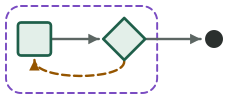

**Use when.** A claim can be broken by one concrete counterexample (a property, an invariant, an edge case), and a bounded search for it is worth more than an open-ended review.

**Not for.** Claims no single input can break (style, clarity), or proving correctness: a hunt that finds nothing is evidence, not proof.

**Cost, speed, rigor.** Low cost, fast speed, standard rigor.

**Shape.** 2 agents · 1 loop · up to 3 rounds · 8 dispatches

**Proving run.** One recorded run, `20260919-1233-k7qm` on Claude Code 2.1.276.

- **Check:** passed.
- **Rounds:** last round 0; no back edge was taken.
- **Ended:** at the stop node `done`; the stop `bar-passed` fired.
- **Cost:** $1.06 (ledger invocation 4).
- [Write-up and evidence](../experiments/patterns/contradiction-seeker/README.md): what happened in that one run, in the author's words.

**Use it.**

```bash
grooph template use contradiction-seeker --name "My graph" \
  --set task="..." --set test-command="..." --set claim="..." \
  --out my-graph.grooph.json
```

In a Claude Code session with the `grooph-design` skill:

```text
/grooph-design propose a graph for <what you are building>, starting from the contradiction-seeker template
```

[Open it in the app](https://ryanjosephkamp.github.io/grooph/#/templates/built-in/contradiction-seeker) · [the template document](../patterns/contradiction-seeker.grooph.json)

<a id="debate-then-build"></a>
### Debate then build

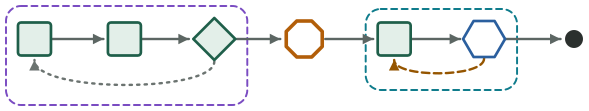

**Use when.** Short adversarial planning, then a small build graph: the right approach is genuinely unclear and a wrong choice is expensive to undo.

**Not for.** Work with an obvious approach, or where drafts are cheaper than arguments (use tournament-then-judge).

**Cost, speed, rigor.** Medium cost, medium speed, standard rigor.

**Shape.** 4 agents · 1 check · 1 gate · 2 loops · up to 7 rounds · Debate: 8 dispatches · Build: 30 minutes

**Proving run.** One recorded run, `20260920-185756` on Claude Code 2.1.278.

- **Check:** passed.
- **Rounds:** last round 0; no back edge was taken.
- **Ended:** halted at `plan-gate`.
- **Cost:** $1.73 (ledger invocation 15).
- [Write-up and evidence](../experiments/patterns/debate-then-build/README.md): what happened in that one run, in the author's words.

**Use it.**

```bash
grooph template use debate-then-build --name "My graph" \
  --set task="..." --set test-command="..." \
  --out my-graph.grooph.json
```

In a Claude Code session with the `grooph-design` skill:

```text
/grooph-design propose a graph for <what you are building>, starting from the debate-then-build template
```

[Open it in the app](https://ryanjosephkamp.github.io/grooph/#/templates/built-in/debate-then-build) · [the template document](../patterns/debate-then-build.grooph.json)

<a id="dual-bar"></a>
### Dual bar


**Use when.** The work needs both a ship line and a directional aspiration: good enough to ship is clear, and better is worth pointing at without ever blocking.

**Not for.** Work where only the aspiration is written down; a bar that cannot be met never stops, so write the ship line first.

**Cost, speed, rigor.** Medium cost, medium speed, standard rigor.

**Shape.** 2 agents · 1 loop · up to 5 rounds · 12 dispatches

**Proving run.** One recorded run, `20260920-191110` on Claude Code 2.1.278.

- **Check:** passed.
- **Rounds:** last round 0; no back edge was taken.
- **Ended:** at the stop node `done`; the stop `bar-passed` fired.
- **Cost:** $1.67 (ledger invocation 17).
- [Write-up and evidence](../experiments/patterns/dual-bar/README.md): what happened in that one run, in the author's words.

**Use it.**

```bash
grooph template use dual-bar --name "My graph" \
  --set task="..." --set test-command="..." --set ship-line="..." --set aspiration="..." \
  --out my-graph.grooph.json
```

In a Claude Code session with the `grooph-design` skill:

```text
/grooph-design propose a graph for <what you are building>, starting from the dual-bar template
```

[Open it in the app](https://ryanjosephkamp.github.io/grooph/#/templates/built-in/dual-bar) · [the template document](../patterns/dual-bar.grooph.json)

<a id="fresh-grind-rare-judge"></a>
### Fresh grind, rare judge

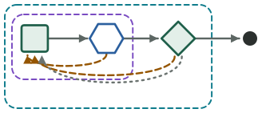

**Use when.** Cheap iteration most steps, an expensive critic at phase boundaries: long work splits into phases that tests can drive but only judgment can sign off.

**Not for.** Short tasks with one phase (use grind-loop or review-gate), or work where the tests cannot drive any of the steps.

**Cost, speed, rigor.** Medium cost, medium speed, high rigor.

**Shape.** 2 agents · 1 check · 2 loops · up to 30 rounds · Grind: 20 minutes · Phases: 55 dispatches

**Proving run.** One recorded run, `20260921-044114` on Claude Code 2.1.278.

- **Check:** passed.
- **Rounds:** last round 1; a back edge was taken (`e-judge-next-phase`), caught by judge (next-phase).
- **Ended:** at the stop node `done`.
- **Cost:** $2.97 (ledger invocation 26).
- **An earlier run** of this template, `20260920-195457`, is kept in `experiments/patterns/fresh-grind-rare-judge/run-1/`; its check failed (PHASE-REVIEW.md was also written by general-purpose, not only judge; judge never read or ran the held-out evidence, so its judgment was not made against it). The run above is the later one.
- [Write-up and evidence](../experiments/patterns/fresh-grind-rare-judge/README.md): what happened in that one run, in the author's words.

**Use it.**

```bash
grooph template use fresh-grind-rare-judge --name "My graph" \
  --set task="..." --set test-command="..." --set phase-checklist="..." \
  --out my-graph.grooph.json
```

In a Claude Code session with the `grooph-design` skill:

```text
/grooph-design propose a graph for <what you are building>, starting from the fresh-grind-rare-judge template
```

[Open it in the app](https://ryanjosephkamp.github.io/grooph/#/templates/built-in/fresh-grind-rare-judge) · [the template document](../patterns/fresh-grind-rare-judge.grooph.json)

<a id="gauntlet-decomposed"></a>
### Gauntlet, decomposed

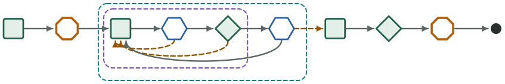

**Use when.** A rendered artifact must match a named reference and is too large for one owner and one critic: the pieces have real seams, each can be captured and judged alone, and they are coupled enough to build in sequence.

**Not for.** One small artifact (taste-polish), no reference (spec-then-loop), or independent pieces that could fan out (ownership-not-swarm); never a way to keep going until the reference loses.

**Cost, speed, rigor.** High cost, slow speed, high rigor.

**Shape.** 5 agents · 2 checks · 2 gates · 2 loops · up to 16 rounds · Polish a piece: 10 dispatches · Pieces: 42 dispatches

**Prior art.** [Matt Shumer's Gauntlet Loop and the Claude of Duty repository](https://github.com/mshumer/Claude-of-Duty): decompose, then builder plus fresh critic per piece against a real reference, blind side by side; here bounded, and pieces run in sequence because the repository's own note says fan-out lost on coupled work.

**Proving run.** One recorded run, `20261004-224501` on Claude Code 2.1.289.

- **Check: failed**, on ten findings; the first: integrator never ran as its own subagent (no summary-card--integrator transcript). The record is kept as it ran (decision 0009), and the findings are the check's own words, below.
- **Rounds:** last round 1; a back edge was taken (`e-next-piece-pass`).
- **Ended:** at the stop node `done`; the stop `human` fired.
- **Cost:** $3.64 (ledger invocations 32 and 33).
- **An earlier run** of this template, `20260922-151855`, is kept in `experiments/patterns/gauntlet-decomposed/run-1/`; its check failed (integrator never ran as its own subagent (no summary-card--integrator transcript); the lead never dispatched summary-card--integrator; no note at node:integrator; final-critic never ran as its own subagent (no summary-card--final-critic transcript); the lead never dispatched summary-card--final-critic; no note at node:final-critic; PIECES.md was also written by summary-card--critic, not only planner; final-critic never wrote FINAL.md itself; the run ended by stop human; the template expects one of: halt at release-gate; final-critic never read or ran the held-out evidence, so its judgment was not made against it). The run above is the later one.
- [Write-up and evidence](../experiments/patterns/gauntlet-decomposed/README.md): what happened in that one run, in the author's words.

<details><summary>The check's ten findings</summary>

- integrator never ran as its own subagent (no summary-card--integrator transcript)
- the lead never dispatched summary-card--integrator
- no note at node:integrator
- final-critic never ran as its own subagent (no summary-card--final-critic transcript)
- the lead never dispatched summary-card--final-critic
- no note at node:final-critic
- final-critic never wrote FINAL.md itself
- replaying every amendment's patch on the source does not give the working copy
- note n-0019: loop:polish records 3 dispatches, but 6 started line(s) at its members precede it
- final-critic never read or ran the held-out evidence, so its judgment was not made against it

</details>

**Use it.**

```bash
grooph template use gauntlet-decomposed --name "My graph" \
  --set task="..." --set reference="..." --set capture-command="..." \
  --out my-graph.grooph.json
```

In a Claude Code session with the `grooph-design` skill:

```text
/grooph-design propose a graph for <what you are building>, starting from the gauntlet-decomposed template
```

[Open it in the app](https://ryanjosephkamp.github.io/grooph/#/templates/built-in/gauntlet-decomposed) · [the template document](../patterns/gauntlet-decomposed.grooph.json)

<a id="grind-loop"></a>
### Grind loop

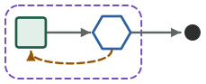

**Use when.** Done and good are the same: tests, types or a task list supply the back pressure, so a passing check is the finish line.

**Not for.** Work where passing tests is not the same as good (taste, design, prose); use review-gate or taste-polish there.

**Cost, speed, rigor.** Low cost, fast speed, light rigor.

**Shape.** 1 agent · 1 check · 1 loop · up to 5 rounds · 30 minutes

**Proving run.** One recorded run, `20260919-1230-k7qm` on Claude Code 2.1.276.

- **Check:** passed.
- **Rounds:** last round 0; no back edge was taken.
- **Ended:** at the stop node `done`.
- **Cost:** $0.66 (ledger invocation 3).
- [Write-up and evidence](../experiments/patterns/grind-loop/README.md): what happened in that one run, in the author's words.

**Use it.**

```bash
grooph template use grind-loop --name "My graph" \
  --set task="..." --set test-command="..." \
  --out my-graph.grooph.json
```

In a Claude Code session with the `grooph-design` skill:

```text
/grooph-design propose a graph for <what you are building>, starting from the grind-loop template
```

[Open it in the app](https://ryanjosephkamp.github.io/grooph/#/templates/built-in/grind-loop) · [the template document](../patterns/grind-loop.grooph.json)

<a id="heterogeneous-critic"></a>
### Heterogeneous critic

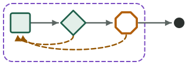

**Use when.** The judge should not share the builder's model when isolating taste or blind spots matters: a same-model critic keeps approving the mistakes the builder makes.

**Not for.** Cheap, routine changes where a same-tier review-gate is enough, or checks a test can make; a stronger critic costs more every round.

**Cost, speed, rigor.** Medium cost, medium speed, high rigor.

**Shape.** 2 agents · 1 gate · 1 loop · up to 4 rounds · 10 dispatches

**Proving run.** One recorded run, `20260920-192538` on Claude Code 2.1.278.

- **Check:** passed.
- **Rounds:** last round 1; a back edge was taken (`e-critic-fail`), caught by critic (fail).
- **Ended:** halted at `merge-gate`.
- **Cost:** $3.40 (ledger invocation 19).
- [Write-up and evidence](../experiments/patterns/heterogeneous-critic/README.md): what happened in that one run, in the author's words.

**Use it.**

```bash
grooph template use heterogeneous-critic --name "My graph" \
  --set task="..." --set test-command="..." --set checklist="..." \
  --out my-graph.grooph.json
```

In a Claude Code session with the `grooph-design` skill:

```text
/grooph-design propose a graph for <what you are building>, starting from the heterogeneous-critic template
```

[Open it in the app](https://ryanjosephkamp.github.io/grooph/#/templates/built-in/heterogeneous-critic) · [the template document](../patterns/heterogeneous-critic.grooph.json)

<a id="metric-sandwich"></a>
### Metric sandwich

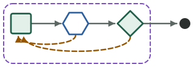

**Use when.** Cheap deterministic checks first, expensive judgment only on what those cannot see: lint and tests catch most failures, and a reviewer should not spend a round on them.

**Not for.** Work with no deterministic check to run first (use review-gate), or where the checks are the whole story (use grind-loop).

**Cost, speed, rigor.** Medium cost, medium speed, standard rigor.

**Shape.** 2 agents · 1 check · 1 loop · up to 5 rounds · 16 dispatches

**Proving run.** One recorded run, `20260919-1241-k7qm` on Claude Code 2.1.276.

- **Check:** passed.
- **Rounds:** last round 0; no back edge was taken.
- **Ended:** at the stop node `done`; the stop `bar-passed` fired.
- **Cost:** $1.49 (ledger invocation 6).
- [Write-up and evidence](../experiments/patterns/metric-sandwich/README.md): what happened in that one run, in the author's words.

**Use it.**

```bash
grooph template use metric-sandwich --name "My graph" \
  --set task="..." --set test-command="..." --set checklist="..." \
  --out my-graph.grooph.json
```

In a Claude Code session with the `grooph-design` skill:

```text
/grooph-design propose a graph for <what you are building>, starting from the metric-sandwich template
```

[Open it in the app](https://ryanjosephkamp.github.io/grooph/#/templates/built-in/metric-sandwich) · [the template document](../patterns/metric-sandwich.grooph.json)

<a id="ownership-not-swarm"></a>
### Ownership, not swarm

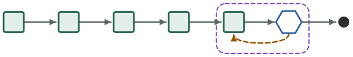

**Use when.** Coupled subsystems get one owner; fan out only the independent pieces. The work spans a shared core and several leaf pieces that touch nothing else.

**Not for.** Work that is all coupled (use one builder in a grind-loop or review-gate) or all independent (a fan-out alone); and never as a way to parallelise a shared core.

**Cost, speed, rigor.** Medium cost, medium speed, standard rigor.

**Shape.** 5 agents · 1 check · 1 loop · up to 3 rounds · 30 minutes

**Prior art.** [Claude of Duty process note (Matt Shumer)](https://github.com/mshumer/Claude-of-Duty): sequential ownership beat parallel fan-out on coupled systems in the repository's own write-up.

**Proving run.** One recorded run, `20260920-193520` on Claude Code 2.1.278.

- **Check:** passed.
- **Rounds:** last round 0; no back edge was taken.
- **Ended:** at the stop node `done`.
- **Cost:** $3.12 (ledger invocation 20).
- [Write-up and evidence](../experiments/patterns/ownership-not-swarm/README.md): what happened in that one run, in the author's words.

**Use it.**

```bash
grooph template use ownership-not-swarm --name "My graph" \
  --set task="..." --set test-command="..." --set subsystem-a="..." --set subsystem-b="..." \
  --out my-graph.grooph.json
```

In a Claude Code session with the `grooph-design` skill:

```text
/grooph-design propose a graph for <what you are building>, starting from the ownership-not-swarm template
```

[Open it in the app](https://ryanjosephkamp.github.io/grooph/#/templates/built-in/ownership-not-swarm) · [the template document](../patterns/ownership-not-swarm.grooph.json)

<a id="patrol-pulse"></a>
### Patrol pulse

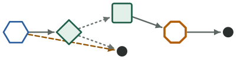

**Use when.** Something should be looked at on a schedule (a log, a queue, a report) and the output of each look is a triaged record for a human, never a change: run the package under the harness's scheduler and each pulse is a run.

**Not for.** Anything that should change code in the same run (use a loop with a builder), or a watch with no durable store to file into: the memory is the project's ticket file or database, named by the slot, not grooph.

**Cost, speed, rigor.** Low cost, fast speed, standard rigor.

**Shape.** 2 agents · 1 check · 1 gate · no loop

**Prior art.**

- [u/croovies's "Lloyd" heartbeat orchestrator, as written up by explainx.ai (2026-08-14; a secondary source)](https://www.explainx.ai/blog/claude-code-loop-orchestrator-heartbeat-ticket-memory-august-2026): a standing checklist per pulse, a read-only investigator, findings to a durable ticket store, humans prioritize.
- [Steve Yegge's Gas Town patrols](https://github.com/gastownhall/gastown): patrol agents that loop by design; here one pulse is one run.

**Proving run.** One recorded run, `20261005-042756` on Claude Code 2.1.289.

- **Check:** passed.
- **Rounds:** no loop round was recorded; no back edge was taken.
- **Ended:** halted at `prioritize`.
- **Cost:** $0.73 (ledger invocation 35).
- **An earlier run** of this template, `20260922-050527`, is kept in `experiments/patterns/patrol-pulse/run-1/`; its check passed. The run above is the later one.
- **An earlier run** of this template, `20261004-225445`, is kept in `experiments/patterns/patrol-pulse/run-2/`; its check failed (investigator never ran as its own subagent (no orders-api-patrol--investigator transcript); the lead never dispatched orders-api-patrol--investigator; no note at node:investigator; ticket-writer never ran as its own subagent (no orders-api-patrol--ticket-writer transcript); the lead never dispatched orders-api-patrol--ticket-writer; no note at node:ticket-writer; investigator never wrote PULSE.md itself; ticket-writer never wrote FILED.md itself; replaying every amendment's patch on the source does not give the working copy; TICKETS.md: 0 added line(s) match /^## T-/; the template expects 1). The run above is the later one.
- [Write-up and evidence](../experiments/patterns/patrol-pulse/README.md): what happened in that one run, in the author's words.

**Use it.**

```bash
grooph template use patrol-pulse --name "My graph" \
  --set task="..." --set scan-command="..." --set ticket-store="..." \
  --out my-graph.grooph.json
```

In a Claude Code session with the `grooph-design` skill:

```text
/grooph-design propose a graph for <what you are building>, starting from the patrol-pulse template
```

[Open it in the app](https://ryanjosephkamp.github.io/grooph/#/templates/built-in/patrol-pulse) · [the template document](../patterns/patrol-pulse.grooph.json)

<a id="ralph-loop"></a>
### Ralph loop

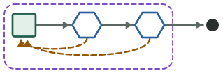

**Use when.** The work is already a prioritized list of small items that tests can check one at a time, and you want a fresh context per item with the plan and an agent file as the only memory.

**Not for.** One item that needs judgment rather than a test (use review-gate or taste-polish), or a plan whose items are too large or too coupled to finish one at a time.

**Cost, speed, rigor.** Low cost, fast speed, light rigor.

**Shape.** 1 agent · 2 checks · 1 loop · up to 5 rounds · 17 dispatches

**Prior art.** [Geoffrey Huntley's ralph loop](https://ghuntley.com/ralph/): one prompt piped into a fresh session per pass; one item of work per pass from a plan file; state on disk; the human as the brake, here replaced by stops.

**Proving run.** One recorded run, `20260922-052016` on Claude Code 2.1.278.

- **Check: failed**, on one finding: builder read the held-out evidence it was told is not its to read (1 tool use(s)). The record is kept as it ran (decision 0009).
- **Rounds:** last round 4; a back edge was taken (`e-plan-check-fail` and `e-tests-fail`), caught by plan-check and tests.
- **Ended:** at the stop node `done`.
- **Cost:** $2.52 (ledger invocation 29).
- [Write-up and evidence](../experiments/patterns/ralph-loop/README.md): what happened in that one run, in the author's words.

**Use it.**

```bash
grooph template use ralph-loop --name "My graph" \
  --set task="..." --set plan-file="..." --set agent-file="..." --set test-command="..." \
  --out my-graph.grooph.json
```

In a Claude Code session with the `grooph-design` skill:

```text
/grooph-design propose a graph for <what you are building>, starting from the ralph-loop template
```

[Open it in the app](https://ryanjosephkamp.github.io/grooph/#/templates/built-in/ralph-loop) · [the template document](../patterns/ralph-loop.grooph.json)

<a id="red-team-loop"></a>
### Red-team loop


**Use when.** A separate attacker should produce failing traces and the builder should see only those: hardening against inputs or abuse nobody has listed yet.

**Not for.** Work with a known list of cases to satisfy (use grind-loop against tests), or judging quality rather than breaking things.

**Cost, speed, rigor.** Medium cost, medium speed, high rigor.

**Shape.** 2 agents · 1 loop · up to 5 rounds · 12 dispatches

**Proving run.** One recorded run, `20260920-191614` on Claude Code 2.1.278.

- **Check:** passed.
- **Rounds:** last round 0; no back edge was taken.
- **Ended:** at the stop node `done`.
- **Cost:** $2.15 (ledger invocation 18).
- [Write-up and evidence](../experiments/patterns/red-team-loop/README.md): what happened in that one run, in the author's words.

**Use it.**

```bash
grooph template use red-team-loop --name "My graph" \
  --set task="..." --set test-command="..." --set attack-surface="..." \
  --out my-graph.grooph.json
```

In a Claude Code session with the `grooph-design` skill:

```text
/grooph-design propose a graph for <what you are building>, starting from the red-team-loop template
```

[Open it in the app](https://ryanjosephkamp.github.io/grooph/#/templates/built-in/red-team-loop) · [the template document](../patterns/red-team-loop.grooph.json)

<a id="retrospective-rewrite"></a>
### Retrospective rewrite

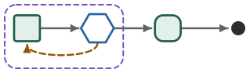

**Use when.** After a run, propose graph edits rather than rewriting mid-flight: the graph is being tuned across runs and the human wants every change as a proposal.

**Not for.** One-off tasks nobody will run again, or when the lead should adapt the graph during the run (the default adaptive level does that).

**Cost, speed, rigor.** Low cost, medium speed, standard rigor.

**Shape.** 2 agents · 1 check · 1 loop · up to 5 rounds · 30 minutes

**Proving run.** One recorded run, `20260920-185135` on Claude Code 2.1.278.

- **Check:** passed.
- **Rounds:** last round 0; no back edge was taken.
- **Ended:** at the stop node `done`.
- **Cost:** $1.45 (ledger invocation 14).
- [Write-up and evidence](../experiments/patterns/retrospective-rewrite/README.md): what happened in that one run, in the author's words.

**Use it.**

```bash
grooph template use retrospective-rewrite --name "My graph" \
  --set task="..." --set test-command="..." \
  --out my-graph.grooph.json
```

In a Claude Code session with the `grooph-design` skill:

```text
/grooph-design propose a graph for <what you are building>, starting from the retrospective-rewrite template
```

[Open it in the app](https://ryanjosephkamp.github.io/grooph/#/templates/built-in/retrospective-rewrite) · [the template document](../patterns/retrospective-rewrite.grooph.json)

<a id="review-gate"></a>
### Review gate


**Use when.** Work, then a separate reviewer, then iterate or pass: the change needs a second pair of eyes against a checklist that already exists.

**Not for.** Work where the tests alone decide done (use grind-loop), or where nobody has written down what good means yet (use spec-then-loop).

**Cost, speed, rigor.** Medium cost, medium speed, standard rigor.

**Shape.** 2 agents · 1 gate · 1 loop · up to 4 rounds · 10 dispatches

**Proving run.** One recorded run, `20260920-172408` on Claude Code 2.1.276.

- **Check:** passed.
- **Rounds:** last round 0; no back edge was taken.
- **Ended:** halted at `merge-gate`.
- **Cost:** $1.36 (ledger invocation 9).
- **An earlier run** of this template, `20260919-1236-k7q2`, is kept in `experiments/patterns/review-gate/run-1/`; its check failed (the final note names no stop, stop node or halt at a gate). The run above is the later one.
- [Write-up and evidence](../experiments/patterns/review-gate/README.md): what happened in that one run, in the author's words.

**Use it.**

```bash
grooph template use review-gate --name "My graph" \
  --set task="..." --set test-command="..." --set checklist="..." \
  --out my-graph.grooph.json
```

In a Claude Code session with the `grooph-design` skill:

```text
/grooph-design propose a graph for <what you are building>, starting from the review-gate template
```

[Open it in the app](https://ryanjosephkamp.github.io/grooph/#/templates/built-in/review-gate) · [the template document](../patterns/review-gate.grooph.json)

<a id="spec-then-loop"></a>
### Spec then loop

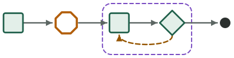

**Use when.** No external reference product exists: a planning pass writes an answer key (ACCEPTANCE.md) that becomes the bar. The default for zero-to-one work.

**Not for.** Work with a reference or checklist already in hand (use review-gate or taste-polish), or changes so small that writing acceptance criteria costs more than the change.

**Cost, speed, rigor.** Medium cost, medium speed, high rigor.

**Shape.** 3 agents · 1 gate · 1 loop · up to 4 rounds · 10 dispatches

**Prior art.** [Answer-key-first Gauntlet, a community modification of Matt Pocock's Wayfinder](https://github.com/mattpocock/skills/blob/main/docs/engineering/wayfinder.md): write the spec and a pass/fail answer key before the loop; the modification is known from a secondary write-up, not a primary source.

**Proving run.** One recorded run, `20260920-172850` on Claude Code 2.1.276.

- **Check:** passed.
- **Rounds:** last round 0; no back edge was taken.
- **Ended:** at the stop node `done`; the stop `bar-passed` fired.
- **Cost:** $2.44 (ledger invocations 10 and 11).
- **An earlier run** of this template, `20260919-1245-k7qz`, is kept in `experiments/patterns/spec-then-loop/run-1/`; its check failed (the first invocation did not end in a halt at spec-gate). The run above is the later one.
- [Write-up and evidence](../experiments/patterns/spec-then-loop/README.md): what happened in that one run, in the author's words.

**Use it.**

```bash
grooph template use spec-then-loop --name "My graph" \
  --set task="..." --set test-command="..." \
  --out my-graph.grooph.json
```

In a Claude Code session with the `grooph-design` skill:

```text
/grooph-design propose a graph for <what you are building>, starting from the spec-then-loop template
```

[Open it in the app](https://ryanjosephkamp.github.io/grooph/#/templates/built-in/spec-then-loop) · [the template document](../patterns/spec-then-loop.grooph.json)

<a id="specialist-critic-bank"></a>
### Specialist critic bank

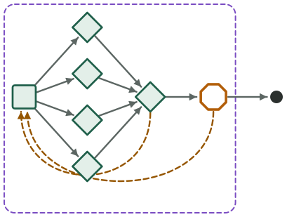

**Use when.** Multiple disjoint judges (correctness, security, performance, taste) should each look at the change, and their findings need merging by severity.

**Not for.** Small or low-risk changes, where one review-gate critic is enough; four reviewers and a judge cost four times a round.

**Cost, speed, rigor.** High cost, medium speed, high rigor.

**Shape.** 6 agents · 1 gate · 1 loop · up to 4 rounds · 26 dispatches

**Proving run.** One recorded run, `20260921-032821` on Claude Code 2.1.278.

- **Check:** passed.
- **Rounds:** last round 0; no back edge was taken.
- **Ended:** halted at `gate`.
- **Cost:** $3.10 (ledger invocation 25).
- **An earlier run** of this template, `20260920-200356`, is kept in `experiments/patterns/specialist-critic-bank/run-1/`; its check failed (the final note names no stop, stop node or halt at a gate; the run ended by nothing named; the template expects one of: halt at gate; note n-0014: loop:review records 8 dispatches, but 6 started line(s) at its members precede it; note n-0027: loop:review records 16 dispatches, but 12 started line(s) at its members precede it). The run above is the later one.
- [Write-up and evidence](../experiments/patterns/specialist-critic-bank/README.md): what happened in that one run, in the author's words.

**Use it.**

```bash
grooph template use specialist-critic-bank --name "My graph" \
  --set task="..." --set test-command="..." \
  --out my-graph.grooph.json
```

In a Claude Code session with the `grooph-design` skill:

```text
/grooph-design propose a graph for <what you are building>, starting from the specialist-critic-bank template
```

[Open it in the app](https://ryanjosephkamp.github.io/grooph/#/templates/built-in/specialist-critic-bank) · [the template document](../patterns/specialist-critic-bank.grooph.json)

<a id="taste-polish"></a>
### Taste polish


**Use when.** Done and good have split: the artifact works but must match a named, inspectable reference, and the polish can be judged from captures.

**Not for.** Zero-to-one work with no reference (use spec-then-loop), or a default for every task: unbounded 'keep going until it beats the reference' is exactly what the stops here prevent.

**Cost, speed, rigor.** High cost, slow speed, high rigor.

**Shape.** 2 agents · 1 check · 1 loop · up to 5 rounds · 16 dispatches

**Prior art.** [Matt Shumer's Gauntlet Loop (Claude of Duty)](https://github.com/mshumer/Claude-of-Duty): the bounded form of the Gauntlet: one owner, an isolated critic against a named reference, real stops.

**Proving run.** One recorded run, `20260920-194427` on Claude Code 2.1.278.

- **Check:** passed.
- **Rounds:** last round 1; a back edge was taken (`e-critic-fail`), caught by critic (fail).
- **Ended:** at the stop node `done`; the stop `bar-passed` fired.
- **Cost:** $3.17 (ledger invocation 21).
- [Write-up and evidence](../experiments/patterns/taste-polish/README.md): what happened in that one run, in the author's words.

**Use it.**

```bash
grooph template use taste-polish --name "My graph" \
  --set task="..." --set reference="..." --set capture-command="..." \
  --out my-graph.grooph.json
```

In a Claude Code session with the `grooph-design` skill:

```text
/grooph-design propose a graph for <what you are building>, starting from the taste-polish template
```

[Open it in the app](https://ryanjosephkamp.github.io/grooph/#/templates/built-in/taste-polish) · [the template document](../patterns/taste-polish.grooph.json)

<a id="tournament-then-judge"></a>
### Tournament then judge

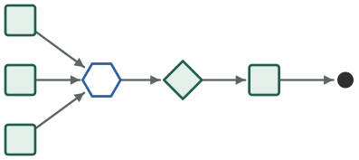

**Use when.** Cheap candidates, then spend the expensive critic on finalists: the approach is open, drafts are cheap, and comparing working options beats arguing about them.

**Not for.** Work with one obvious approach, or coupled changes to a shared core: candidates that must touch the same files cannot run side by side.

**Cost, speed, rigor.** Medium cost, fast speed, standard rigor.

**Shape.** 5 agents · 1 check · no loop

**Proving run.** One recorded run, `20260920-190434` on Claude Code 2.1.278.

- **Check:** passed.
- **Rounds:** no loop round was recorded; no back edge was taken.
- **Ended:** at the stop node `done`.
- **Cost:** $2.64 (ledger invocation 16).
- [Write-up and evidence](../experiments/patterns/tournament-then-judge/README.md): what happened in that one run, in the author's words.

**Use it.**

```bash
grooph template use tournament-then-judge --name "My graph" \
  --set task="..." --set test-command="..." --set criteria="..." \
  --out my-graph.grooph.json
```

In a Claude Code session with the `grooph-design` skill:

```text
/grooph-design propose a graph for <what you are building>, starting from the tournament-then-judge template
```

[Open it in the app](https://ryanjosephkamp.github.io/grooph/#/templates/built-in/tournament-then-judge) · [the template document](../patterns/tournament-then-judge.grooph.json)

## Fragments

<a id="human-gated-irreversible"></a>
### Human-gated irreversible step


**Use when.** A step cannot be undone (merge, spend, publish, delete) and must wait for a human decision; this fragment satisfies E_IRREVERSIBLE_NO_GATE.

**Not for.** Reversible steps, where a gate only slows the run; and it gates only the way in you connect to it: every edge into the action must pass the gate.

**Cost, speed, rigor.** Low cost, fast speed, standard rigor.

**Shape.** 1 agent · 1 gate · no loop

**Proving run.** One recorded run, `20260920-184824` on Claude Code 2.1.278.

- **Check:** passed.
- **Rounds:** last round 0; no back edge was taken.
- **Ended:** halted at `gate`.
- **Cost:** $0.70 (ledger invocation 13).
- [Write-up and evidence](../experiments/patterns/human-gated-irreversible/README.md): what happened in that one run, in the author's words.

**Use it.**

```bash
grooph template insert human-gated-irreversible --into my-graph.grooph.json \
  --set action="..." --set irreversible="..." \
  --write
```

In a Claude Code session with the `grooph-design` skill:

```text
/grooph-design add the human-gated-irreversible fragment to my graph
```

[Open it in the app](https://ryanjosephkamp.github.io/grooph/#/templates/built-in/human-gated-irreversible) · [the template document](../patterns/human-gated-irreversible.grooph.json)

<a id="merge-queue"></a>
### Merge queue

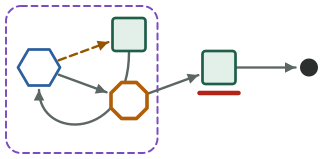

**Use when.** Several reviewed changes wait to land together and the integration command (build, lint, tests) is the arbiter: insert this before the host's stop node so a batch lands only green and only on a human's word.

**Not for.** A single change (human-gated-irreversible is enough), or a host whose changes are not yet reviewed: the queue integrates, it does not review.

**Cost, speed, rigor.** Low cost, medium speed, standard rigor.

**Shape.** 2 agents · 1 check · 1 gate · 1 loop · up to 4 rounds · 9 dispatches

**Prior art.**

- [Steve Yegge's Gas Town Refinery](https://github.com/gastownhall/gastown): a merge queue that integrates a batch, bisects on failure and lands by a human's word.
- [Bors](https://github.com/bors-ng/bors-ng): batch then bisect.

**Proving run.** One recorded run, `20260922-051355` on Claude Code 2.1.278.

- **Check:** passed.
- **Rounds:** last round 1; a back edge was taken (`e-bisect-integrate`), caught by integrate.
- **Ended:** halted at `land-gate`.
- **Cost:** $1.09 (ledger invocation 28).
- [Write-up and evidence](../experiments/patterns/merge-queue/README.md): what happened in that one run, in the author's words.

**Use it.**

```bash
grooph template insert merge-queue --into my-graph.grooph.json \
  --set integration-command="..." --set queue-file="..." --set land-command="..." \
  --write
```

In a Claude Code session with the `grooph-design` skill:

```text
/grooph-design add the merge-queue fragment to my graph
```

[Open it in the app](https://ryanjosephkamp.github.io/grooph/#/templates/built-in/merge-queue) · [the template document](../patterns/merge-queue.grooph.json)

_Generated by `scripts/field-guide.mjs` from `patterns/` and `experiments/patterns/`, like `field-guide/` beside it (the glyphs and the poster). Edit a template or a record, then run `node scripts/field-guide.mjs`; CI fails when any of them is stale._
