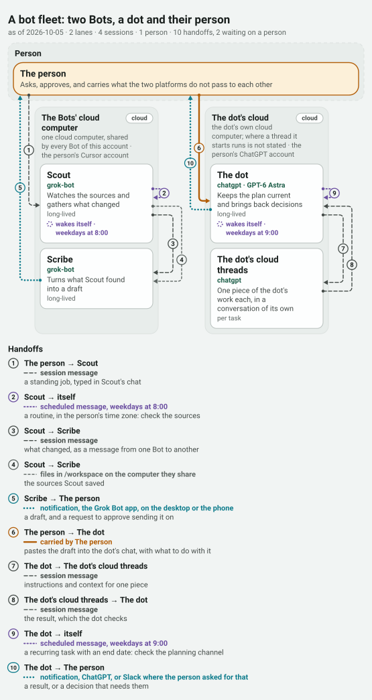

# Bot fleets on other platforms

Reading, and one drawing. The owner asked whether grooph could reach fleets of bots on platforms other than a coding harness: the dots in ChatGPT, Grok Bot, and others like them. This folder is what was found in the vendors' own documentation on 2026-10-05, a sample fleet drawn as an [operation map](../operation-map.md), and a page on [what it would take](what-it-would-take.md).

Nothing here was run on any of these platforms: nobody at grooph has access to them. No compile target was built, and this folder makes no claim about what grooph does for such a fleet's work.

## The pages

| Platform | A fleet there, in one line | Page |
|---|---|---|
| Grok Bot | named Bots of one account on one shared cloud computer, messaging each other and sharing group chats | [`grok-bot.md`](grok-bot.md) |
| dots in ChatGPT | one dot for one person, handing work to agents, threads and tasks of its own; nothing found from dot to dot | [`openai-dots.md`](openai-dots.md) |
| Hermes Agent, Bot Mode | profiles on a person's own machines shown as a roster of Bots, with a tool for messaging a teammate | [`hermes.md`](hermes.md) |
| OpenClaw | several agents behind one self-hosted gateway, with a tool for running another agent's session | [`openclaw.md`](openclaw.md) |

The first two are the ones the owner named. The other two were chosen as the closest in kind whose own documentation says how one bot reaches another; both are open source and run on a person's own machine, which matters for what could be tried without anyone's account ([what it would take](what-it-would-take.md)).

Each page answers the same seven questions: what a bot is there, how one starts or messages another, what a tool and a limit are, what can be scheduled, what a human approval is, what leaves a record, and what the platform tells a program outside it.

## The marks

Every statement on those pages carries one, as in [`subagents.md`](../subagents.md):

- **[doc]** the vendor's own page says so, with the page linked. All were read on 2026-10-05, and each page's last section lists the addresses.
- **[seen]** grooph observed it. On the four platform pages nothing is.
- **[unknown]** the pages read do not say. Nothing was filled in from memory or from an article about the product.

A statement about grooph itself (what a command printed, what a view showed) says where it was tried.

## The sample fleet

[`fixtures/maps/valid/a-bot-fleet.grooph-map.json`](../../fixtures/maps/valid/a-bot-fleet.grooph-map.json): two Grok Bots, a dot, the threads the dot starts, and the person they work for. Every handoff on it is one a vendor's page describes, or the person. It needed no new code: a session's `harness` may be any string, and here it is `grok-bot` and `chatgpt`.



The same map [as a phone draws it](../../fixtures/maps/pictures/a-bot-fleet.light.svg) and [as a sequence](../../fixtures/maps/pictures/a-bot-fleet.sequence.light.svg); each has a dark twin beside it. `grooph validate` finds no issues and names the two handoffs that wait on the person:

```
a-bot-fleet: 2 lanes · 4 sessions · 1 person · 10 handoffs, 2 waiting on a person
fixtures/maps/valid/a-bot-fleet.grooph-map.json: no issues
by hand  h-job  person → scout: moves only when The person does it
by hand  h-carry  person → dot: moves only when The person does it
```

The pictures are drawn by `grooph image <map> --theme light|dark`, with `--layout wide` and `--view sequence` for the other two. No test compares these six files with what the code draws, so after a change to the drawing they are drawn again by hand.

### What the map could say about such a fleet

**A lane is one machine under one account, and that is Grok Bot's own unit:** every Bot of an account on one shared computer. The dot's cloud is a second lane under a second account (the pages do not say which computer a thread it starts runs on, and the lane says so). **A carrier between two Bots is the platform's own message,** a `session-message`, which validates clean because both ends are in one harness and one account; the files they share on that computer are an `other` carrier with a name; a routine is a `scheduled-message` from a Bot to itself; and an approval is two handoffs, a `notification` to the person and what the person then does. **Between the two platforms no page describes a channel.** Each vendor describes work started by a Slack message, and neither says whether a post by another product's bot counts. So on the sample the carrier is the person, and the map says so twice: in the gate color, and in the list of what moves only by hand. Drawn the other way, as a Bot messaging the dot, the validator objects with `W_CARRIER_CANNOT_CROSS`, which is the rule doing its job (tried on a copy of the map).

### What had no place in the format

- **A group chat.** A room of two to six Bots where any of them may answer is not work passing from one end to another. A handoff has two ends; a room would be drawn as a handoff for every pair, or hidden in an `other` carrier.
- **A service that starts work.** A Slack message that fires a routine comes from neither a session nor a person, and a handoff's end must be one of those (`E_DANGLING_REF`, tried on a copy). The map can only say it as a routine the Bot runs for itself.
- **A platform's own channel into another product.** The vendor's page says a dot creates a Codex task on a connected computer. With the dot as `chatgpt` and the task as `codex`, a `session-message` between them is warned about, because the rule holds a session message to one harness name (tried on a copy). It can be drawn clean only as `other`.
- **Limits and rules.** Fifty routines, three rounds, a rule that asks first, a review that runs before an action: a map has no brakes and no gates. Those belong to a graph, which is one session. On a map they are prose in a description.
- **A bot that is not one session.** A Bot or a dot is one lasting agent with many conversations and a memory; `lifetime: "long-lived"` is the nearest a session comes. A Team Bot works on a different computer depending on who is talking to it, and a session has one lane.
- **What a bot remembers** from one task to the next, and what all of a team's Bots share, is nowhere on a map.
