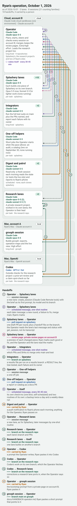

# The operation map (v0)

A second kind of grooph document, beside the graph. A **graph** is one harness session and its subagents: the lead is the main session and every other agent node is a subagent (`graph-ir.md` §1 and §2). An **operation map** is the picture one level up: several sessions, in different harnesses, on different machines and accounts, and how work passes between them.

A map is **drawn and validated. It is never compiled, exported as a package or run** (amendment A-011). grooph still starts nothing and supervises nothing. This page is normative for the map as `graph-ir.md` is for the graph.

Encoding: JSON, canonical form (§5). File extension `.grooph-map.json`. Published JSON Schema: `packages/core/schema/grooph-map-0.schema.json`, generated from the types below; the types win when they disagree.

## 1. Shape

TypeScript notation, normative. Ids are kebab-case and unique across the map itself, its lanes, its sessions and its handoffs.

```ts
type OperationMap = {
  groophMap: 0;                    // document schema version. A graph carries `grooph`; a map carries `groophMap`. Neither key appears in the other.
  id: Id;
  name: string;
  version: number;
  asOf?: string;                   // the day the map describes, as YYYY-MM-DD. A map is a snapshot; operations move.
  description?: string;

  lanes: Lane[];
  sessions: Session[];
  handoffs: Handoff[];
};
```

### Lanes

A lane is one machine under one account: the unit inside which sessions can see each other's files and, usually, talk through the harness. Everything that crosses a lane boundary needs a carrier both sides can reach.

```ts
type Lane = {
  id: Id; name: string;
  machine: string;                 // where its sessions run: "MacBook", "cloud sandboxes"
  place?: "local" | "cloud";
  account: string;                 // whose sign-in the sessions use: "Claude account A", "OpenAI account"
  description?: string;
};
```

### Sessions

A session is one harness session, or a family of like sessions drawn as one.

```ts
type Session = {
  id: Id; name: string;
  lane: Id;                        // the lane it runs in
  harness: HarnessId;              // "claude-code" | "codex" | any other string
  model?: string;                  // as the harness names it today; free text, not a tier (a map records what is, a graph asks for a class)
  role: string;                    // what this session is for, in one line
  lifetime?: "long-lived" | "per-task" | "scheduled";
  count?: number;                  // a family: twelve worker sessions are one node with count 12
  graph?: string;                  // the loop graph this session runs: a path or URL to a `.grooph.json`, or "<graph-id>@<version>"
  repo?: string;                   // the repository it works in
  description?: string;
};
```

`graph` is a pointer, not a copy. When it is a web link (a share link from `grooph share <graph>`, say) the app opens it from the session's details, so a session on the map leads into its own loop graph. The map stays small (spec §4.7) and the graph stays the single source of truth for what happens inside that session. This is the first form of the nested-graph reference `graph-ir.md` §9 defers: a session points down at a graph; a graph does not yet point at another graph.

### Handoffs

A handoff is work passing from one session to another. It always names its carrier: the thing that actually moves the work across.

```ts
type Handoff = {
  id: Id;
  from: Id; to: Id;                // session ids; the same id twice is a session that wakes itself
  carrier?: Carrier;               // required by rule (E_HANDOFF_NO_CARRIER), so its absence gets a named error and not a schema path
  what?: string;                   // what is handed over: "a slice handoff", "test results"
  label?: string;
};

type Carrier =
  | { kind: "branch"; repo?: string; ref?: string }        // a repository branch both sides can fetch
  | { kind: "pull-request"; repo?: string }                // a pull request on that repository
  | { kind: "session-message" }                            // the harness's own channel: one session starts or messages another
  | { kind: "scheduled-message"; schedule?: string }       // a routine or timer that puts a prompt into a session
  | { kind: "review-page"; where?: string }                // a published page someone reads; `where` says where it lives
  | { kind: "person"; who?: string }                       // a person carrying a prompt from one session to another
  | { kind: "other"; name?: string };                      // anything else, named
```

## 2. Semantics

A map describes; it does not instruct. Nothing reads a map at run time.

- **A session is the unit of context.** What is inside a session (its subagents, its loops, its brakes) is a graph's business. The map shows only that the session exists, what it runs on, and what it exchanges with the others.
- **A handoff is one direction.** Work that goes out and comes back is two handoffs, usually with two different carriers (a message out, a pull request back).
- **A carrier is what both ends can reach.** A branch needs a repository both sides can fetch. A session message needs one harness and one account. A person can cross anything, and is the slowest carrier there is.
- **A family is one node.** `count` says how many; the handoffs to and from it are to and from each member.
- **A map is a snapshot.** `asOf` dates it. A map that is out of date is wrong, not harmful: nothing depends on it.

## 3. Validation rules

Same output as a graph's: a list of `{ code, severity, message, at }`. Codes are stable. Each has a failing fixture under `fixtures/maps/invalid/<CODE>/` and the valid maps under `fixtures/maps/valid/` raise none.

### Structural (the graph's codes, with the same meaning)

| Code | Rule |
|---|---|
| `E_SCHEMA` | The document fails the map schema. The message names the path. |
| `E_DUPLICATE_ID` | An id appears more than once across the map, its lanes, its sessions and its handoffs. |
| `E_DANGLING_REF` | A session names a lane that does not exist, or a handoff names a session that does not exist. |

### The map's own

| Code | Rule |
|---|---|
| `E_HANDOFF_NO_CARRIER` | A handoff has no `carrier`, or its carrier does not name what carries it: a `branch` or `pull-request` with no `repo`, a `person` with no `who`, a `review-page` with no `where`, an `other` with no `name`. "Somehow" is not a carrier. |
| `W_CARRIER_CANNOT_CROSS` | A handoff's carrier lives inside one harness or one account, and the two sessions are not in the same one: a `session-message` or `scheduled-message` between sessions whose lanes have different accounts or whose harnesses differ; a `review-page` between sessions whose lanes have different accounts (a published page belongs to the account that published it). A warning, because a harness may bridge this one day; today such a handoff is usually a person in disguise. |
| `W_SESSION_ISLAND` | A session has no handoff in or out. Nothing reaches it and it reaches nothing. |
| `W_NO_RETURN` | A session receives a handoff and hands nothing on. Work goes in and no result comes out by any named carrier. |
| `W_GRAPH_UNRESOLVED` | A session's `graph` pointer was checked and did not lead to a graph document. Raised only where the checker can look (the CLI, for a path beside the map); a map in a link is not checked. |
| `W_UNKNOWN_KEY` | A key the schema does not know. Kept and preserved, as in a graph. |
| `W_DOC_TOO_LARGE` | The canonical form exceeds 24,000 characters: the same "rewrite in one pass" budget as a graph. |

### Said, not warned: what a person carries

A handoff carried by a `person` is a true statement about an operation, so it is not an issue and a map full of them still validates clean. It is where work stalls when that person is away, so grooph says it every time it checks a map: `grooph validate` lists each one after the issues (`by hand  <handoff>  <from> → <to>: moves only when <who> carries it`), `--json` and `grooph shape --json` carry the same list as `byHand`, `grooph_validate` returns it, and the app shows it in the map's details. The picture already draws these handoffs in the gate colour.

## 4. The picture

`mapPicture(map, { theme })` in core draws a map as one SVG, laid out for a phone: lanes stacked top to bottom, each session a card in its lane, each handoff an arc in the margin with a number, and a numbered list of the handoffs below (who to whom, by what carrier, carrying what). Line style says the carrier kind. It is a projection: it never round-trips, and edits happen in the document. The words come first: the cards keep a little over half of a lane's width however many handoffs there are (the tracks in the margin close up instead), and a name, a model or a role that does not fit its line goes onto the next.

The same picture is what `grooph image` writes (`--theme light`, `dark` or `auto`) and what the app shows for a map opened from a link or a file. `light` and `dark` write the colours into the file; `auto` carries both and follows the viewer's colour scheme. In the app a session or a handoff opens what the document says about it, and the map's issues are behind the status, as a graph's are.

## 4a. Where a map goes

| Command | What it does with a map |
|---|---|
| `grooph validate <map>` | the rules of §3, then what a person carries by hand; a `graph` pointer that is a path is looked up beside the map |
| `grooph canonicalize <map> [--write]` | canonical form (§5) |
| `grooph shape <map> [--json]` | lanes, sessions, handoffs, how many a person carries |
| `grooph image <map> [--out <file.svg \| file.png>] [--theme …]` | the picture, as SVG or PNG |
| `grooph outline <map>` · `grooph page <map> --out <file.html>` | the map to read top to bottom; the one offline file ([`exports.md`](exports.md)) |
| `grooph share <map>` | a link that opens the map in the app; a map with rule errors still shares, and the view names them |
| `grooph export <map> …` | refused, by name: a map is never compiled |

In the app, Import on the first screen takes a `.grooph-map.json` and opens the same view as the link. A map is looked at, not stored.

## 4b. A live map

A map says who exists. The event hook says who is at work ([`subagents.md`](subagents.md)). Put together, the picture marks each session with what the hook has seen of it: a filled dot and `working · 2 running, 5 done`, a ring and `waiting`, or `ended`.

The tie is a name on the command line, not a field in the map: events read under a map session's id belong to that session.

```bash
grooph image ops.grooph-map.json --out ops-now.png \
  --events operator=. --events workers=git:origin/lane-a --events workers=git:origin/lane-b
grooph page  ops.grooph-map.json --out ops-now.html --events operator=.
grooph watch --map ops.grooph-map.json --events operator=. --events workers=git:origin/lane-a
```

A source is an events file, a folder, a project, or `git:<ref>`. Several sources under one name are summed, which is how a family of twelve reads `3 of 12 working`. A session with no source of its name is drawn as the map alone draws it. `image` and `page` are snapshots, stamped with the time they were read; `watch` serves a page that asks again every two seconds.

The map document is not changed by any of this, and still holds no state: `mapLive(sessions, map)` in core computes the marks, and `mapPicture(map, { live, at })` draws them. A map remains something that is drawn and validated, never run; what is laid over it is observation (amendment A-012).

## 5. Canonical form

As a graph's (`graph-ir.md` §7): two-space indent, LF, one trailing newline, keys in the order the types above list them, arrays in document order, unknown keys kept and sorted after the known ones.

## 6. Example

[`fixtures/maps/valid/owner-operation-2026-10-01.grooph-map.json`](../fixtures/maps/valid/owner-operation-2026-10-01.grooph-map.json): the owner's operation on 2026-10-01, as the Operator session that runs it corrected it, with the product's own details left out. Its picture, as `grooph image` draws it: [light](../fixtures/maps/pictures/ryans-operation-2026-10-01.light.svg), [dark](../fixtures/maps/pictures/ryans-operation-2026-10-01.dark.svg).



One Operator session in the cloud leads everything on its account: ten worker lanes, two long-lived test runners, short helpers and two morning routines for one project, and three lanes of a second, private project. It starts a lane with the harness's own session tool and steers it afterwards with one-shot scheduled messages. Work comes back as pull requests, as branches, and through review pages the owner marks. Codex on the Mac and this repository's own session are reached only by the owner carrying a prompt, and answer on a branch. Three of the eighteen handoffs wait on a person, and `grooph validate` names them.

The first draft, [`owner-operation-2026-09-30.grooph-map.json`](../fixtures/maps/valid/owner-operation-2026-09-30.grooph-map.json), was drawn from the owner's brief alone and guessed where the brief was silent (seven sessions, ten handoffs). It is kept as a fixture; the difference between the two is what asking the session that runs the operation was worth.

## 7. Deferred

Named so nobody designs them twice: a saved `layout` for a map (the picture is automatic in v0); a graph pointing at another graph; a binding from a map session to its events written in the map itself (today it is a name on the command line, §4b); maps stored in the app's library (a map opens from a link or a file); editing a map in the app (agents and hands edit the document).
