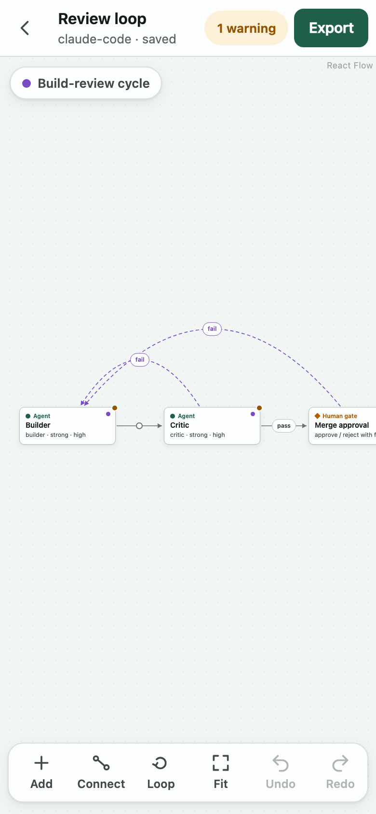
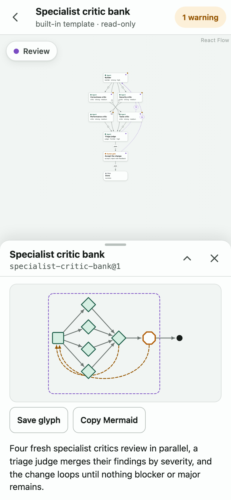
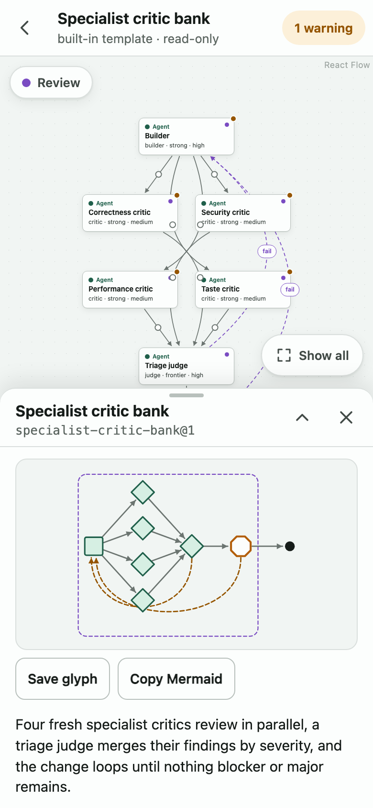
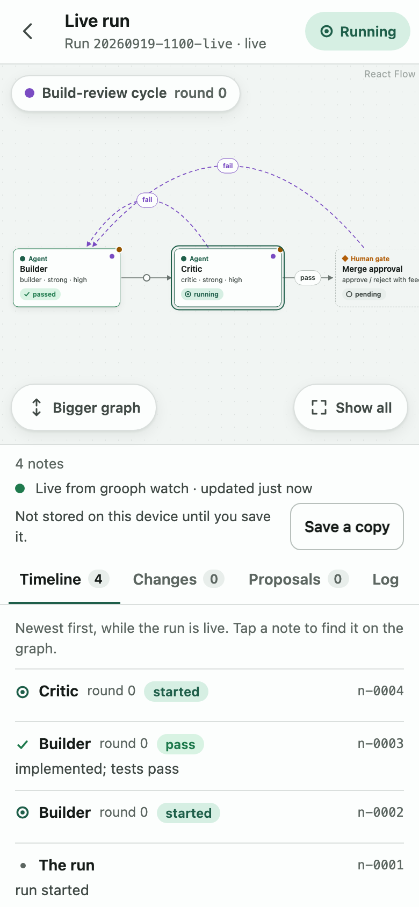
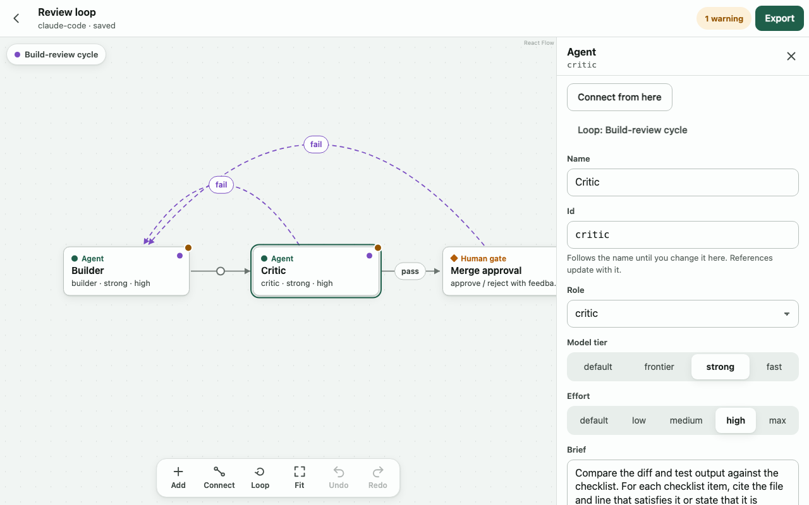
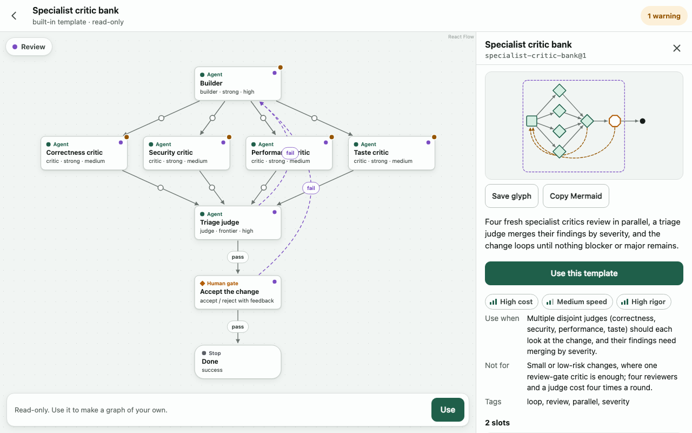

# Fresh-eyes review, 2026-09-30

A cold pass over grooph after a week's pause, by a session that had not seen it before: build it, run the tests, use the CLI, and look at the app on a 390 px phone and a 1280 px computer, light and dark. This page says what works, what is broken, what feels rough, and which fixes were made in the same pull request.

## How it was looked at

| What | How | Result |
|---|---|---|
| Build | `pnpm install --frozen-lockfile && pnpm -r build` (Node 25.2.1, pnpm 11.7.0) | clean |
| Unit tests | `pnpm -r test` | core 282, cli 60, web 49: all pass |
| Browser tests | `pnpm --filter @grooph/web test:e2e` (emulated 400×800 phone, touch) | 60 pass |
| CLI | `grooph --help`, `validate`, `template list`, `runs list`, `share`, `watch` on the fixtures | each did what its help says |
| Live site | `curl` of https://ryanjosephkamp.github.io/grooph/ | 200 |
| CI | `gh run list` on `main` | last CI and deploy green (2026-09-22) |
| The app | `e2e/screenshots-review.spec.ts` (new): library, editor, a node's sheet, a template, the templates list, the compare view, a finished run and a live run, at 390×844 and 1280×800, light and dark | 32 screenshots read one by one |

Not done: a real finger on a real phone. Everything here is Chromium with touch emulation.

## What works

Nothing is broken at the level of "a command fails" or "a screen is blank". The build, all tests, the CLI and the live site were green on arrival, and the working tree was clean.

- **The whole path holds together.** A graph validates, exports, shares as a link, opens read-only, saves, edits, and round-trips byte for byte. The compare view, the templates page and the run view all read well on a phone and in dark mode.
- **The phone layout is careful.** Tap targets are 44 px, the toolbar docks above the sheet, the sheet expands, and state is shown by icon and word as well as colour.
- **The CLI explains itself.** Every command answers `--help`, errors name what to do next, and `watch` says what it will and will not do before it does it.
- **The documents agree with the code.** `docs/graph-ir.md`, the target doc and `docs/runs.md` matched what the code does everywhere I checked.

## What is broken

| # | What | Where it came from | State |
|---|---|---|---|
| 1 | Typing a number (a round limit, a budget) made one undo step per digit | review 0007 | **fixed** |
| 2 | An undo did not show in a list field or a number field that still had focus, until it lost focus | review 0007 | **fixed** |
| 3 | Undoing an insert left its "where each id landed" list on screen, describing nodes that were gone | review 0007 | **fixed** |
| 4 | A share link with a malformed `%` throws | handback 0008 | **already fixed** in slice 0010 for `#/g/` and `#/run/`. The `#/open?d=` route never decoded its payload, so it never threw. A new test covers every route with a `%` that is not an escape. |
| 5 | The README promises an outline view and an MCP server | bootstrap brief | **made honest**: the README now says both are planned. Both are scheduled in this round (the outline with the exports, the MCP server after the live view). |
| 6 | The web bundle is 815 KB, over the 800 KB limit the build warns at | this review | not fixed; it has been over since slice 0015. Harmless (239 KB gzipped), noted so the warning is not a surprise. |

## What feels rough on a phone (390 px)

| # | What | State |
|---|---|---|
| 7 | **A wide layout opened at a third of full size.** The review-loop fixture's own layout is about 1,000 px in a row; fitted to the screen, its node names were about 4 px tall. | **fixed**: see below |
| 8 | **A long graph above a sheet opened at a fifth of full size.** The template page opens with its description sheet covering half the screen; an eight-node template was fitted into the 180 px left over. | **fixed**: same change |
| 9 | **The run view's canvas is 42% of the screen**, so a long graph was small there too. | **fixed**: same change, plus a "Bigger graph" control that gives the canvas three quarters of the screen |
| 10 | **Pinch and drag were untested.** Every browser test tapped; none moved a finger. | **tested**: `e2e/touch.spec.ts` sends real multi-touch input (two fingers pinching, one dragging a node, one panning) to the editor and the read-only viewer. All pass. A hand on glass is still the owner's check. |
| 11 | **About four taps per edge.** Handback 0002 counted close-sheet, Connect, source, target. | not changed. "Connect from here" in a node's sheet (added in slice 0007) already makes it three: source, Connect from here, target. Manual authoring is kept, not optimised (decision 0007). |
| 12 | A back edge's label can sit on a node's name when the loop spans a fan-out (the `fail` label on "Performance critic" in `specialist-critic-bank`). | not fixed; see ranked list |
| 13 | Glyphs of long graphs are slivers in the templates list (`gauntlet-decomposed`, `debate-then-build`). | not fixed; see ranked list |

### The change for 7, 8 and 9

A canvas no longer opens below half size. When the whole graph fits at half size or more, it opens whole, as before. When it does not, it opens at half size with its start in view (the left edge of a wide graph, the top of a tall one), and the rest is a drag away. The whole graph is one tap: **Fit** in the editor's toolbar, **Show all** in the read-only viewers (which had no such control), and **Readable size** to come back.

| Before | After |
|---|---|
|  |  |
|  |  |

The live run view with both new controls: 

Half size is the floor because a node's name is 14 px at full size: 7 px is the least a phone shows legibly, and it is the size the run view already drew a four-node graph at. The rule is one function (`openingViewport` in `apps/web/src/ui/canvas/fit.ts`) with unit tests.

A second option was considered and not built: redraw a wide saved layout top to bottom in the read-only viewers, since a portrait screen suits a portrait graph. It reads better still, but it shows a picture that is not the document's own layout, which is a design change rather than polish. It is the owner's call (question 2 below).

## What feels rough on a computer (1280 px)

| # | What | State |
|---|---|---|
| 14 | **Opening a node's panel hides the right-hand nodes.** The panel takes 400 px from the canvas and the graph is not refitted, so "Done" in the review loop sits off the edge until Fit is pressed.  | not fixed. The editor deliberately pans and never zooms when a sheet opens, so the node being edited stays put under the cursor. A refit only when the view has not been moved by hand would fix it without that cost; ranked below. |
| 12 | The same back-edge label collision as on the phone, more visible here.  | not fixed |
| 15 | The library and the templates list are a single 690 px column on any width. | fine as it is; noted, not a defect |

## Ranked fixes

Done in this pull request, in the order they matter:

1. Canvases open at a readable size; Show all in viewers; a bigger run canvas (7, 8, 9).
2. The three undo bugs (1, 2, 3).
3. Multi-touch tests for pinch and drag (10).
4. The malformed-`%` test (4) and the honest README (5).

Next, small and clear, not yet done:

5. Refit the editor when a panel opens on a wide screen, if the view has not been moved by hand (14).
6. Keep back-edge labels off node names (12): the label of an edge that crosses a node moves along its curve to the nearest clear point.
7. A portrait glyph for long graphs in list rows, or a wider thumbnail (13).
8. Raise the bundle warning limit to match reality, or split the run view into its own chunk (6).

Waiting on the owner, because they are choices rather than fixes:

9. Portrait redraw of wide layouts in read-only viewers (the option above).
10. Fewer taps per edge (11): for example, staying in Connect after an edge is made. Decision 0007 says not to optimise this; say so if that has changed.

## What was verified, and what was not

- Verified: every number in the tables above comes from a command run in this session; the screenshots shown here are in `docs/review-2026-10/`, and the full set of 32 is regenerated (into `apps/web/test-results/review-shots/`) by `GROOPH_SHOTS=1 pnpm --filter @grooph/web exec playwright test e2e/screenshots-review.spec.ts`.
- After the fixes: core 282, cli 60, web 54 unit tests and 67 browser tests pass.
- Not verified: anything on a physical phone (real fingers, the on-screen keyboard, iOS Safari). Safari and Firefox were not run at all; the suite is Chromium only.
- Assumed: that half size is the right floor. It is a constant (`READABLE_ZOOM`) and easy to move.
