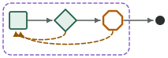
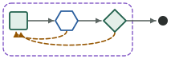

# Paired comparisons · first study

Does a grooph graph produce better work than a prompt that says the same things? Decision 0011 made this question the project's effectiveness evidence; [`docs/comparisons.md`](../../docs/comparisons.md) is the protocol; this folder is the first study (stage 10a, slice 0016, 2026-09-21). Four templates, one designed project each, three arms under equal conditions, scored by one script, judged blind, written up with the one required line per project: **did the graph earn its cost**.

**Two studies share this folder and are never one table.** This page is the record of study one, as it was written, down to "Study two" near the end. Study two (slice 0019, protocol version 2) adds a fourth arm, other models and tasks built so a first pass fails; its three projects were pre-registered and then run on 2026-10-04, and what they showed is in that section.

| Arm | What ran |
|---|---|
| **A · graph** | the template's package, headless, exactly as `scripts/prove-pattern.sh` runs a proving run |
| **B · prompt** | one prompt in one headless session: the package flattened into prose by rule ([`scripts/lib/compare-prompt.mjs`](../../scripts/lib/compare-prompt.mjs), protocol §3), with none of grooph's mechanics; committed per project as `prompt-B.md` |
| **C · prompt in a loop** | the B prompt in a fresh headless session up to N times, N the template's round cap, each told to continue from the tree and stop when its done check passes (`loop-C.sh`) |

Equal in every arm and recorded in every `result.json`: the committed task folder and its held-out suite beside the scratch, lead `claude-opus-5` at effort `high`, the proving allowlist plus `Read` on the held-out folder, `--strict-mcp-config`, one dollar ceiling per invocation from [`ledger.json`](ledger.json), Claude Code 2.1.278. `scripts/compare.sh` makes the runs; `--status` shows the ledger; `scripts/lib/compare-summary.mjs` generates every table below from the records, so the numbers cannot drift from the evidence.

## The four projects

_(generated by `node scripts/lib/compare-summary.mjs --index`)_

| Project | Runs | Held-out range by arm (passes) | Cost range by arm | Judge ranks (A · B · C) | Spend incl. judge |
|---|---|---|---|---|---|
| <br>[`grind-loop`](grind-loop/README.md) | 6 | A 61 · B 61 · C 61 of 62 | A $0.60–$0.66 · B $0.31–$0.34 · C $0.30–$0.31 | 6,3 · 4,5 · 1,2 | $3.03 |
| <br>[`red-team-loop`](red-team-loop/README.md) | 6 | A 73 · B 73 · C 73 of 73 | A $2.63–$3.57 · B $3.36–$9.02 · C $3.60–$4.59 | 5,4 · 6,2 · 1,3 | $28.67 |
| <br>[`review-gate`](review-gate/README.md) | 6 | A 41 · B 41 · C 41 of 41 | A $1.02–$1.40 · B $1.05–$1.08 · C $0.98–$1.05 | 4,6 · 2,3 · 1,5 | $7.06 |
| <br>[`spec-then-loop`](spec-then-loop/README.md) | 9 | A 88 · B 88 · C 88 of 88 | A $2.43–$2.56 · B $2.26–$2.66 · C $1.96–$2.04 | 6,7,9 · 1,8,3 · 5,2,4 | $21.87 |

**Spend:** $60.62 of the $100.00 cap across 40 invocations ([`ledger.json`](ledger.json)); $39.38 left.

Held-out passes are ranges over the replicates (a single number means every replicate scored the same); the judge's ranks are per replicate, 1 best, over all runs of that project. Order of runs within a project: A1 B1 C1 A2 B2 C2 (A3 B3 C3).

## What the study showed

**The graph did not earn its cost in any of the four projects, by each project's own pre-registered test.** On every project every arm reached the same held-out score in every replicate: 61/62 for `grind-loop` (the same 2^53 case failed in all six), 41/41, 73/73, 88/88. The blind judge never placed the graph's runs at the top of a project and put them last in three of four. Costs overlap on three projects; on `grind-loop` the graph cost about twice the prompt for the same result.

**Why: the derived prompt kept the design, and the sessions followed it.** Rule 2 of the protocol removes grooph's mechanics — the run folder, the notes, the working copy, the CLI — but keeps the roles, the routing, the loop sentence, the gate sentence and every brief with its model and effort. In all 27 runs the prompt-arm lead dispatched the roles as separate subagents on the models the prose named (a `sonnet` builder for `grind-loop`; a `fable` planner and red team; an isolated critic that alone read the held-out suite in `review-gate`), stopped at the gate where the prose said to, and ran a fresh critic against the answer key after it. The prose bought the isolation, the tiers and the halt that the templates' bets rested on. What it did not buy — and what arm A paid 10–15 extra harness turns for each time — is the run record: `notes.jsonl`, `PROGRESS.md`, the working copy, the dispatch counts, the halt note a monitor can read and a run id can resume.

**Where the arms did differ, it was in bounding, not in output.** `red-team-loop` B-1 is the study's one cut-off: its red team found two "traces" outside the contract, its builder widened the API to fix them, and a second attack round ran until the $9.00 ceiling ($9.02, 24m51s), while both A runs stopped by the graph's own pass edge at round 0 for $2.63–$3.57. The package's loop stops and dispatch budgets are the one place the structure showed.

**None of the four loops turned.** No critic, check or red team in 27 runs sent a builder back; every bar passed at round 0. The tasks were chosen for objective bars and reused from the proving ground, where three of the four had already passed at round 0 once. A comparison that can show what a loop is worth needs a task a strong builder does not finish in one pass; these did not, so the study measured the structure's overhead and its bounding, not its correction.

Per project, the required line, from each write-up:

- [`grind-loop`](grind-loop/README.md): **no, as pre-registered** — 61/62 in every arm; A $0.60–$0.66 against B $0.31–$0.34.
- [`review-gate`](review-gate/README.md): **no** — 41/41 in every arm at $1.02–$1.40 (A) against $1.05–$1.08 (B); B's own critic subagent read the suite, as A's critic did.
- [`red-team-loop`](red-team-loop/README.md): **no** — 73/73 in every arm; A the cheapest arm here ($2.63–$3.57) because it stopped at round 0 while one B run hit the ceiling.
- [`spec-then-loop`](spec-then-loop/README.md): **no, in three of three** — 88/88 in every arm at $2.43–$2.56 (A) against $2.26–$2.66 (B); the judge ranked the three A runs 6, 7 and 9 of 9.

## What this study can and cannot show

It can show, for four small designed tasks on one harness version and one model family, whether the package produced work that a held-out suite and a blind frontier judge rate above the same instructions given as prose, and what each arm cost. Ranges, never means: n is two per arm (three for `spec-then-loop`), so a difference of one held-out case or one judge rank is noise, and only a range that lies wholly above another says anything. It cannot show that a graph beats a human team, a named product (spec §15) or a different model; it says nothing about tasks larger than one function with a written contract, about graphs with more than three nodes, or about work where the human gate is real (`spec-then-loop` ran on a scripted approve, labelled in its write-up). The B prompt is derived by a rule that removes grooph's mechanics but keeps the roles, the routing and the briefs, and every prompt arm in this study chose to dispatch the roles as subagents: what the study compares is therefore the **package** against **the same design said in prose**, not structure against no structure. A prompt that omitted the roles would be a different arm, and a fairer test of "no graph" would need one.

## Study two

Protocol version 2 ([`docs/comparisons.md`](../../docs/comparisons.md), decision 0012; slice 0019). Study one could not tell the graph's design from its record, because the derived prompt kept the roles, and could not make a loop turn, because every task passed at round 0. Study two changes four things.

- **A fourth arm.** **D · task only**: the task, the names of its acceptance files and the test command, in one session, with no roles, routing, loop or briefs. Its prompt is written from the task folder alone and committed as `prompt-D.md`. The held-out material is named to nobody in D, and no copy of it is anywhere near a D run.
- **Tasks built so a first pass fails.** Each project's task leaves points open that its held-out suite settles one way, and each pre-registration states the expected chance of a round-0 pass and why. Beside each task are a solution that passes the suite and a plain first pass, the shortest honest reading written without it, that does not; `scripts/lib/compare-projects.test.mjs` holds those numbers to the files. They are one author's code, not a model's, and are never copied into a run. A second reader, given the tasks and the suites and nothing of the design, looked for cases that were unfair, brittle or wrongly filed; what it found was corrected before any run, and each project's page says what.
- **Other models.** The lead of every arm and the blind judge are `claude-opus-5-5` (study one: `claude-opus-5` leads, a `claude-fable-5-1` judge). Every package is exported with a tier map the project pre-registers (`tier_map` in its `expect.json`, handed to `grooph export` as `GROOPH_MODELS`), so no tier falls back to the target's own and no call uses Fable. **The two studies are not compared run for run.**
- **A session that is told nothing of what it is part of.** No task file names grooph or the held-out folder; a slot value names the folder, where the template hands its checklist or its reference to the critic. A session is shown its folder's path, its repository's user and its last commits, so a scratch project is named after the task's own package, sits alone in a folder of its own, and has one commit, "initial commit", which in B, C and D never held the package. No skill is listed to any session, because this machine has the tool's own design skill installed for every project; in B, C and D no folder on PATH holds the tool's command; and a session's temp folder is its run's own. (Study one's prompt arms were shown the commit that removed the package, by name, and were listed that skill.) The scorer runs each suite from this repository, never from a copy a run could reach, and each run's folder is removed once its evidence is here. What a session can still reach, if it goes looking, is the rest of this machine: the runner cannot fence that off, so each record lists what its sessions reached for outside their project and counts how often the tool's name stands in their transcripts.

| Project | Template | Task | Held-out | Expected round-0 pass | A first pass, measured |
|---|---|---|---|---|---|
| [`heterogeneous-critic`](heterogeneous-critic/README.md) | `heterogeneous-critic` | parse the page box of a print dialog; seven points left open | 70 cases | 0.03 | 56 of 70 |
| [`review-gate-2`](review-gate-2/README.md) | `review-gate` | lay one layer of settings on another; a checklist with two items the task does not state, four points left open | 55 cases | 0.03 | 36 of 55 |
| [`taste-polish`](taste-polish/README.md) | `taste-polish` | polish a plain-text usage statement against a reference with seven properties the style brief does not state | 24 cases | 0.01 | 14 of 24 |

**What study two is expected to show about brakes, and what it is not.** In study one no loop turned, arm C never ran a second iteration, and no round cap or dispatch budget fired in any package run. Each pre-registration of study two therefore says which brake is expected to fire. In `heterogeneous-critic` and `review-gate-2`: none (a fail at round 0, a pass at round 1, the halt at the merge gate); those two can show a loop turning, not a cap bounding anything. In `taste-polish`: the human check-in every 2 rounds, in arm A, in about four runs of ten, when round 1 leaves a major gap open. That is the one run in which "the graph bounds the work" can be shown, by whether a prompt arm told the same stop in prose runs past it, and it is no better than an even chance that the check-in comes due at all. **No run of study two is expected to hit a round cap or a dispatch budget**: in the two review templates the bar is expected to pass first, and in `taste-polish` the check-in comes due first. Showing a cap or a budget fire would take a project built for it, with a task its builder cannot finish inside the cap; study two has none.

Four arms, two replicates, in the order A1 B1 C1 D1 A2 B2 C2 D2; one blind judgment per project over eight candidates, under letters that are never A to D. Each write-up will carry two required lines: **did the graph earn its cost**, and **did a loop turn, and did the turn change the result**.

**Status, 2026-10-04:** all 24 runs and the three blind judgments are recorded. The owner named the tier map on that day, before any run: `frontier` Opus 5.5, `strong` Sonnet 5.5, `fast` Sonnet 5.5. No node of the three projects is on `fast`; in `heterogeneous-critic` and `taste-polish` an Opus 5.5 critic checked a Sonnet 5.5 builder, and in `review-gate-2` both were Sonnet 5.5. The harness reported those two models and no other in any run.

_(generated by `node scripts/lib/compare-summary.mjs --index`)_

| Project | Runs | Held-out range by arm (passes) | Cost range by arm | Judge ranks (A · B · C · D) | Spend incl. judge |
|---|---|---|---|---|---|
| <br>[`heterogeneous-critic`](heterogeneous-critic/README.md) | 8 | A 70 · B 70 · C 70 · D 52 of 70 | A $1.29–$1.60 · B $1.03–$1.05 · C $1.03–$1.09 · D $0.26 | 7,8 · 5,6 · 4,3 · 1,2 | $7.96 |
| <br>[`review-gate-2`](review-gate-2/README.md) | 8 | A 55 · B 55 · C 55 · D 51 of 55 | A $1.18–$1.23 · B $0.67–$0.69 · C $0.64–$0.80 · D $0.33–$0.35 | 4,5 · 6,8 · 3,7 · 2,1 | $6.39 |
| <br>[`taste-polish`](taste-polish/README.md) | 8 | A 24 · B 24 · C 24 · D 15 of 24 | A $1.42–$1.58 · B $0.88–$0.89 · C $0.90–$0.96 · D $0.25–$0.42 | 3,7 · 1,2 · 8,6 · 4,5 | $7.68 |

**Spend, study two:** $22.03 across 27 invocations ([`ledger.json`](ledger.json)).

**The ledger, both studies:** $82.66 across 67 invocations; no cap since the owner lifted it, $9.00 per invocation. The driver is told at each $50.00, and one project stops and asks at $60.00.

Held-out passes are ranges over the two replicates (a single number means both scored the same); the judge's ranks are per replicate, 1 best, over the eight runs of that project. Order of runs within a project: A1 B1 C1 D1 A2 B2 C2 D2.

### What study two showed

**The graph did not earn its cost in any of the three projects, by each project's own pre-registered test.** In every project arm B, the package said as prose in one session, matched arm A on held-out passes in both replicates at lower cost: 55 of 55 at $0.67 to $0.69 against $1.18 to $1.23; 70 of 70 at $1.03 to $1.05 against $1.29 to $1.60; 24 of 24 at $0.88 to $0.89 against $1.42 to $1.58. Arm C did the same. The package's runs took between two and eight times the harness turns of the prompt arms (30 to 49 turns against 5 to 13). What the extra bought is the run record: the notes, each round's report kept beside the next, the halt note at a gate, the amendments.

**Every loop turned, once, and the turn changed the result.** This is what study one could not show. In all 18 runs with a reviewer the first pass failed the held-out material and the second passed it: 44 to 55, 52 to 70, and in `taste-polish` from four major gaps to none. **How far that is shown and how far it is reported differs by arm.** In the six package runs it is in the records: each run's notes, its kept round-0 report, and in two runs a kept round-0 diff that, rebuilt and scored, gives the same count (44 of 55 for `review-gate-2/A-2`, 52 of 70 for `heterogeneous-critic/A-1`). In the twelve prompt-arm runs the repository holds the four dispatches in order (builder, critic, builder, critic, in each transcript digest), each builder's own account of what it fixed and the final tree; the round-0 counts are derived from the harness's transcripts, which are not in the repository. `taste-polish` has no round-0 count in any arm, and in no run of the study did the scorer score a round-0 tree. Where a count could be read, every first pass of a project landed on the same number, in the package and in the prose alike. The pre-registered estimates that a first pass would fail (0.03, 0.03, 0.01 for a pass) held: none of 24 first passes passed.

**The design, in all three of its forms, ended above no design in every project, by a range wholly above the other:** 55 against 51 of 55, 70 against 52 of 70, 24 against 15 of 24, for two to six times arm D's cost. Arm D is one Opus 5.5 session with the task, its acceptance files and the test command. What it lacked is what the cases turn on: resolutions the task leaves open and a reviewer holds. So the difference shows that a reviewer with held-out evidence moves a builder to that evidence in one round. It is the same in the package and in the prose, and it is not a measure of quality by anything the builder was given.

**The blind judge and the held-out suite disagreed, by construction.** The judge is given what the builder saw, not the suite. In the two code projects it ranked both D runs first and second and marked the six others down for what the task did not ask for ("an unrequested rule", "untasked behaviour"): exactly the behavior the suites require and the critics asked for. In `taste-polish`, judging the rendered statement against the style brief, it interleaved the arms. On tasks built with hidden resolutions the blind judgment measures fidelity to the visible text, and it cannot be read as a ranking of quality. The protocol should say so, or give the judge the suite's resolutions.

**No brake fired, and study two shows nothing about bounding.** No round cap and no dispatch budget was reached in any of the six package runs: each ended at round 1. The one stop that could have come due, `taste-polish`'s human check-in, was expected in about four A runs of ten and came due in neither. Arm C ran one iteration in all six of its runs, as in study one: the prose carries the whole loop, so a session that finishes says done. Showing a cap or a budget at work needs a project built for it, with a task its builder cannot finish inside the cap; study two has none.

**What a session was told of where it was.** In B, C and D the tool's name stands in none of the 66 transcripts and its command was not on PATH; no skill was listed to any session. Across the 24 runs, sessions reached outside their own project seven times, all in `taste-polish`: six refused attempts to write a helper script to `/tmp`, and one critic reading its own reference by a relative path. None reached for another run's work.

Per project, the two required lines, from each write-up:

- [`review-gate-2`](review-gate-2/README.md): **did the graph earn its cost: no**, B matched A at 55 of 55 in both replicates at lower cost. **Did a loop turn, and did the turn change the result: yes**, in all six runs with a reviewer, from 44 to 55; D ended at 51.
- [`heterogeneous-critic`](heterogeneous-critic/README.md): **no**, B matched A at 70 of 70 at lower cost. **Yes**, in all six, from 52 to 70; D ended at 52, the same 18 cases every first pass failed.
- [`taste-polish`](taste-polish/README.md): **no**, B matched A at 24 of 24 at lower cost. **Yes**, in all six, one turn each, to 24 of 24; D ended at 15.

### What study two can and cannot show

It can show, for three small designed tasks on one harness version and two models of one family, that a loop built from a builder and a reviewer who holds evidence the builder cannot see turns once and reaches that evidence; that the same design given as prose does the same for less; and what each arm cost. Ranges, never means: n is two per arm. Here every range is a single number, both replicates scoring the same, so the differences between D and the rest do not rest on one run; they do rest on tasks built so a first pass would fail, by one author, with suites whose first versions an independent reader had to correct. It cannot show that a graph beats a human team, a named product (spec §15) or another model; anything about tasks larger than one function or one rendered page; anything about a loop that needs more than one turn; or anything about stops, caps and budgets, none of which was reached. Arm D's session was Opus 5.5 and the builders of the other arms were Sonnet 5.5, so D's first pass and theirs are two models' guesses as well as two designs; where both could be counted they were close (51 against 44, 52 against 52). **The two studies are not compared run for run:** other models, other tasks, a fourth arm, and study one's prompt arms were shown the tool's name by the scratch repository's commits and by a listed skill.

## Layout

```
<project>/            task/, slots.json, expect.json (pre-registration + scorer paths), held-out/,
                      prompt-B.md, loop-C.sh, README.md (pre-registration first, then results);
                      in study two also prompt-D.md and reference/ (a solution and a first pass, never run)
<project>/<arm>-<n>/  claude-output*.json, project.diff, result.json, score.json,
                      transcript-digest.json, settings.json, prompts/; for A also runs/ and package/;
                      artifact/ when the project names a rendered one for the judge
<project>/judge/      transcript.md, verdict.json, mapping.json (letters → runs; the judge never saw it)
ledger.json           every model call of the study, written by the runner
```

Evidence is never edited (decision 0009). A losing result is published as such.
