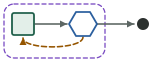
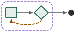
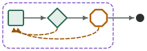
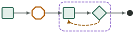

# Paired comparisons · first study

Does a grooph graph produce better work than a prompt that says the same things? Decision 0011 made this question the project's effectiveness evidence; [`docs/comparisons.md`](../../docs/comparisons.md) is the protocol; this folder is the first study (stage 10a, slice 0016, 2026-09-21). Four templates, one designed project each, three arms under equal conditions, scored by one script, judged blind, written up with the one required line per project: **did the graph earn its cost**.

**Two studies share this folder and are never one table.** This page is the record of study one, as it was written, down to "Study two" near the end. Study two (slice 0019, protocol version 2) adds a fourth arm, other models and tasks built so a first pass fails; its three projects are prepared and pre-registered, and none has run yet.

| Arm | What ran |
|---|---|
| **A · graph** | the template's package, headless, exactly as `scripts/prove-pattern.sh` runs a proving run |
| **B · prompt** | one prompt in one headless session: the package flattened into prose by rule ([`scripts/lib/compare-prompt.mjs`](../../scripts/lib/compare-prompt.mjs), protocol §3), with none of grooph's mechanics; committed per project as `prompt-B.md` |
| **C · prompt in a loop** | the B prompt in a fresh headless session up to N times, N the template's round cap, each told to continue from the tree and stop when its done check passes (`loop-C.sh`) |

Equal in every arm and recorded in every `result.json`: the committed task folder and its held-out suite beside the scratch, lead `claude-opus-5` at effort `high`, the proving allowlist plus `Read` on the held-out folder, `--strict-mcp-config`, one dollar ceiling per invocation from [`ledger.json`](ledger.json), Claude Code 2.1.278. `scripts/compare.sh` makes the runs; `--status` shows the ledger; `scripts/lib/compare-summary.mjs` generates every table below from the records, so the numbers cannot drift from the evidence.

## The four projects

_(generated by `node scripts/lib/compare-summary.mjs --index`)_

| Project | Runs | Held-out range by arm (passes) | Cost range by arm | Judge ranks (A · B · C) | Spend incl. judge |
|---|---|---|---|---|---|
| <br>[`grind-loop`](grind-loop/README.md) | 6 | A 61 · B 61 · C 61 of 62 | A $0.60–$0.66 · B $0.31–$0.34 · C $0.30–$0.31 | 6,3 · 4,5 · 1,2 | $3.03 |
| <br>[`red-team-loop`](red-team-loop/README.md) | 6 | A 73 · B 73 · C 73 of 73 | A $2.63–$3.57 · B $3.36–$9.02 · C $3.60–$4.59 | 5,4 · 6,2 · 1,3 | $28.67 |
| <br>[`review-gate`](review-gate/README.md) | 6 | A 41 · B 41 · C 41 of 41 | A $1.02–$1.40 · B $1.05–$1.08 · C $0.98–$1.05 | 4,6 · 2,3 · 1,5 | $7.06 |
| <br>[`spec-then-loop`](spec-then-loop/README.md) | 9 | A 88 · B 88 · C 88 of 88 | A $2.43–$2.56 · B $2.26–$2.66 · C $1.96–$2.04 | 6,7,9 · 1,8,3 · 5,2,4 | $21.87 |

**Spend:** $60.62 of the $100.00 cap across 40 invocations ([`ledger.json`](ledger.json)); $39.38 left.

Held-out passes are ranges over the replicates (a single number means every replicate scored the same); the judge's ranks are per replicate, 1 best, over all runs of that project. Order of runs within a project: A1 B1 C1 A2 B2 C2 (A3 B3 C3).

## What the study showed

**The graph did not earn its cost in any of the four projects, by each project's own pre-registered test.** On every project every arm reached the same held-out score in every replicate: 61/62 for `grind-loop` (the same 2^53 case failed in all six), 41/41, 73/73, 88/88. The blind judge never placed the graph's runs at the top of a project and put them last in three of four. Costs overlap on three projects; on `grind-loop` the graph cost about twice the prompt for the same result.

**Why: the derived prompt kept the design, and the sessions followed it.** Rule 2 of the protocol removes grooph's mechanics — the run folder, the notes, the working copy, the CLI — but keeps the roles, the routing, the loop sentence, the gate sentence and every brief with its model and effort. In all 27 runs the prompt-arm lead dispatched the roles as separate subagents on the models the prose named (a `sonnet` builder for `grind-loop`; a `fable` planner and red team; an isolated critic that alone read the held-out suite in `review-gate`), stopped at the gate where the prose said to, and ran a fresh critic against the answer key after it. The prose bought the isolation, the tiers and the halt that the templates' bets rested on. What it did not buy — and what arm A paid 10–15 extra harness turns for each time — is the run record: `notes.jsonl`, `PROGRESS.md`, the working copy, the dispatch counts, the halt note a monitor can read and a run id can resume.

**Where the arms did differ, it was in bounding, not in output.** `red-team-loop` B-1 is the study's one cut-off: its red team found two "traces" outside the contract, its builder widened the API to fix them, and a second attack round ran until the $9.00 ceiling ($9.02, 24m51s), while both A runs stopped by the graph's own pass edge at round 0 for $2.63–$3.57. The package's loop stops and dispatch budgets are the one place the structure showed.

**None of the four loops turned.** No critic, check or red team in 27 runs sent a builder back; every bar passed at round 0. The tasks were chosen for objective bars and reused from the proving ground, where three of the four had already passed at round 0 once. A comparison that can show what a loop is worth needs a task a strong builder does not finish in one pass; these did not, so the study measured the structure's overhead and its bounding, not its correction.

Per project, the required line, from each write-up:

- [`grind-loop`](grind-loop/README.md): **no, as pre-registered** — 61/62 in every arm; A $0.60–$0.66 against B $0.31–$0.34.
- [`review-gate`](review-gate/README.md): **no** — 41/41 in every arm at $1.02–$1.40 (A) against $1.05–$1.08 (B); B's own critic subagent read the suite, as A's critic did.
- [`red-team-loop`](red-team-loop/README.md): **no** — 73/73 in every arm; A the cheapest arm here ($2.63–$3.57) because it stopped at round 0 while one B run hit the ceiling.
- [`spec-then-loop`](spec-then-loop/README.md): **no, in three of three** — 88/88 in every arm at $2.43–$2.56 (A) against $2.26–$2.66 (B); the judge ranked the three A runs 6, 7 and 9 of 9.

## What this study can and cannot show

It can show, for four small designed tasks on one harness version and one model family, whether the package produced work that a held-out suite and a blind frontier judge rate above the same instructions given as prose, and what each arm cost. Ranges, never means: n is two per arm (three for `spec-then-loop`), so a difference of one held-out case or one judge rank is noise, and only a range that lies wholly above another says anything. It cannot show that a graph beats a human team, a named product (spec §15) or a different model; it says nothing about tasks larger than one function with a written contract, about graphs with more than three nodes, or about work where the human gate is real (`spec-then-loop` ran on a scripted approve, labelled in its write-up). The B prompt is derived by a rule that removes grooph's mechanics but keeps the roles, the routing and the briefs, and every prompt arm in this study chose to dispatch the roles as subagents: what the study compares is therefore the **package** against **the same design said in prose**, not structure against no structure. A prompt that omitted the roles would be a different arm, and a fairer test of "no graph" would need one.

## Study two

Protocol version 2 ([`docs/comparisons.md`](../../docs/comparisons.md), decision 0012; slice 0019). Study one could not tell the graph's design from its record, because the derived prompt kept the roles, and could not make a loop turn, because every task passed at round 0. Study two changes four things.

- **A fourth arm.** **D · task only**: the task, the names of its acceptance files and the test command, in one session, with no roles, routing, loop or briefs. Its prompt is written from the task folder alone and committed as `prompt-D.md`. The held-out material is named to nobody in D and is moved away from its scratch project for the run.
- **Tasks built so a first pass fails.** Each project's task leaves points open that its held-out suite settles one way, and each pre-registration states the expected chance of a round-0 pass and why. Beside each task are a solution that passes the suite and a first pass, written without it, that does not; `scripts/lib/compare-projects.test.mjs` holds those numbers to the files. They are one author's code and are never copied into a run.
- **Other models.** The lead of every arm and the blind judge are `claude-opus-5-5` (study one: `claude-opus-5` leads, a `claude-fable-5-1` judge). Every package is exported with a tier map the project pre-registers (`tier_map` in its `expect.json`, handed to `grooph export` as `GROOPH_MODELS`), so no tier falls back to the target's own and no call uses Fable. **The two studies are not compared run for run.**
- **A task folder that says nothing of the tool or the suite.** No task file names grooph or the held-out folder; a slot value names the folder, where the template hands its checklist or its reference to the critic. A scratch project is named after the task's own package.

| Project | Template | Task | Held-out | Expected round-0 pass | A first pass, measured |
|---|---|---|---|---|---|
| [`heterogeneous-critic`](heterogeneous-critic/README.md) | `heterogeneous-critic` | parse the page box of a print dialog; six points left open | 68 cases | 0.03 | 45 of 68 |
| [`review-gate-2`](review-gate-2/README.md) | `review-gate` | lay one layer of settings on another; a checklist with two items the task does not state, three points left open | 55 cases | 0.05 | 38 of 55 |
| [`taste-polish`](taste-polish/README.md) | `taste-polish` | polish a plain-text usage statement against a reference with seven properties the style brief does not state | 24 cases | 0.01 | 12 of 24 |

Four arms, two replicates, in the order A1 B1 C1 D1 A2 B2 C2 D2; one blind judgment per project over eight candidates, under letters that are never A to D. Each write-up will carry two required lines: **did the graph earn its cost**, and **did a loop turn, and did the turn change the result**.

**Status, 2026-10-04:** the runner, the three projects and their pre-registrations are committed, and every arm of every project has had a dry run. **No run has been made.** The tier map is a named field and is not filled in yet; the runner starts no paid run until it is. The index below is generated when runs exist.

_(generated by `node scripts/lib/compare-summary.mjs --index`)_

No run yet; projects prepared: `heterogeneous-critic`, `review-gate-2`, `taste-polish`.

**The ledger, both studies:** $60.62 across 40 invocations; no cap since the owner lifted it, $9.00 per invocation. The driver is told at each $50.00, and one project stops and asks at $60.00.

## Layout

```
<project>/            task/, slots.json, expect.json (pre-registration + scorer paths), held-out/,
                      prompt-B.md, loop-C.sh, README.md (pre-registration first, then results);
                      in study two also prompt-D.md and reference/ (a solution and a first pass, never run)
<project>/<arm>-<n>/  claude-output*.json, project.diff, result.json, score.json,
                      transcript-digest.json, settings.json, prompts/; for A also runs/ and package/;
                      artifact/ when the project names a rendered one for the judge
<project>/judge/      transcript.md, verdict.json, mapping.json (letters → runs; the judge never saw it)
ledger.json           every model call of the study, written by the runner
```

Evidence is never edited (decision 0009). A losing result is published as such.
