# Pattern proving ground

One recorded headless Claude Code run per template, on a small task designed so the template's point can show; since slice 0017 the task is pre-registered before the run, with why a first pass should fail and the expected round-0 pass probability (decision 0012). Each folder holds the task (`task/`), the slot values (`slots.json`), what the check asserts (`expect.json`), any evidence held out for the critic (`held-out/`), the evidence (`run/`) and a one-screen write-up (`README.md`). A write-up says what happened in one run (spec §15); it does not claim the template beats anything.

`scripts/prove-pattern.sh <id>` makes a run; `--dry-run` does everything but the model call, and `--check <id>/run` re-asserts on the evidence. [`ledger.json`](ledger.json) records every model call and its cost.

## First batch (slice 0009, 2026-09-19)

Claude Code 2.1.276; the lead ran on `claude-opus-5` in every run.

| Template | Run | Passes | Stop fired | Ending | Cost | Harness turns | Amendments | Denials | `--check` |
|---|---|---|---|---|---|---|---|---|---|
| [`grind-loop`](grind-loop/README.md) | `20260919-1230-k7qm` | 1 | none (check passed) | stop node `done` | $0.66 | 16 | 0 | 3 | pass |
| [`contradiction-seeker`](contradiction-seeker/README.md) | `20260919-1233-k7qm` | 1 | bar-passed | stop node `done` | $1.06 | 18 | 0 | 8 | pass |
| [`review-gate`](review-gate/README.md) | `20260919-1236-k7q2` | 1 | bar-passed | waits at `merge-gate`, **no halt note** | $1.45 | 27 | 1 | 7 | **fail** (ending) |
| [`metric-sandwich`](metric-sandwich/README.md) | `20260919-1241-k7qm` | 1 | bar-passed | stop node `done` | $1.49 | 20 | 0 | 4 | pass |
| [`spec-then-loop`](spec-then-loop/README.md) | `20260919-1245-k7qz` | 1 (critic ran twice) | bar-passed | stop node `done`, after one **scripted** approve at `spec-gate` (no halt note there) | $2.33 | 45 | 1 | 10 | **fail** (first halt) |

**Spend:** $7.01 of the $25.00 cap: $6.99 on the five runs and $0.02 on a two-call harness probe that showed a resumed session reports only its own cost ([`ledger.json`](ledger.json), invocations 1–2).

## Re-proving after slice 0010 (2026-09-20)

The two gate templates again, on the hardened brief and templates, with `--retry "0010 hardening"`; the first batch's evidence moved to `run-1/` beside the new `run/`. Claude Code 2.1.276; lead on `claude-opus-5`; `--strict-mcp-config`, and `echo`, `cp`, `tr` allowed.

| Template | Run | Passes | Stop fired | Ending | Cost | Harness turns | Amendments | Denials | `--check` |
|---|---|---|---|---|---|---|---|---|---|
| [`review-gate`](review-gate/README.md#re-proved-after-slice-0010) | `20260920-172408` | 1 | bar-passed (`stop` on the loop note) | **halt note** at `merge-gate`, then the ask | $1.36 | 22 | 0 | 2 | pass |
| [`spec-then-loop`](spec-then-loop/README.md#re-proved-after-slice-0010) | `20260920-172850` | 1 | bar-passed (`stop` on the loop note) | **halt note** at `spec-gate`, scripted approve, then `done` | $2.44 | 35 | 0 | 14 | pass |

Both run ids are the clock's (`<yyyymmdd-hhmmss>`), both records carry `started` lines and clock timestamps in order, and both leads counted dispatches against the budget. The `spec-then-loop` critic, now with the repository read-only, passed the answer key at round 0 where the first run returned `invalid-evidence`. Still no back edge taken.

**Spend:** $3.80 for the three invocations ([`ledger.json`](ledger.json), invocations 9–11); $10.81 of the $25.00 cap in all.

## Second batch (slice 0011, 2026-09-20)

The remaining eleven templates, on tasks built so a first-round pass is unlikely: held-out cases a critic or judge holds and the builder never sees (`heterogeneous-critic`, `taste-polish`, `fresh-grind-rare-judge`), a real search space for an adversarial critic (`red-team-loop`, `specialist-critic-bank`), or an under-specified ask (`debate-then-build`). Each write-up names its mechanism and says whether the bet paid. Claude Code 2.1.278; lead on `claude-opus-5`; every gate halted and none was answered by script; `human-gated-irreversible` was proved as a fragment inserted into a `grind-loop` host. Rows are generated by `scripts/lib/prove-summary.mjs` from the records.

| Template | Run | Last round | Back edge taken, caught by | Ending | Cost | Harness turns | Denials | Dispatch count | `--check` |
|---|---|---|---|---|---|---|---|---|---|
| [`human-gated-irreversible`](human-gated-irreversible/README.md) | `20260920-184824` | 0 | none | halt at gate | $0.70 | 14 | 1 | no count kept | pass |
| [`retrospective-rewrite`](retrospective-rewrite/README.md) | `20260920-185135` | 0 | none | stop node done | $1.45 | 23 | 2 | no count kept | pass |
| [`debate-then-build`](debate-then-build/README.md) | `20260920-185756` | 0 | none | halt at plan-gate | $1.73 | 21 | 1 | exact (3) | pass |
| [`tournament-then-judge`](tournament-then-judge/README.md) | `20260920-190434` | – | none | stop node done | $2.64 | 4 | 0 | no count kept | pass |
| [`dual-bar`](dual-bar/README.md) | `20260920-191110` | 0 | none | stop node done, stop bar-passed | $1.67 | 20 | 2 | exact (2) | pass |
| [`red-team-loop`](red-team-loop/README.md) | `20260920-191614` | 0 | none | stop node done | $2.15 | 20 | 2 | exact (2) | pass |
| [`heterogeneous-critic`](heterogeneous-critic/README.md) | `20260920-192538` | 1 | yes: e-critic-fail; caught by critic (fail) | halt at merge-gate | $3.40 | 36 | 9 | exact (2, 4) | pass |
| [`ownership-not-swarm`](ownership-not-swarm/README.md) | `20260920-193520` | 0 | none | stop node done | $3.12 | 11 | 2 | no count kept | pass |
| [`taste-polish`](taste-polish/README.md) | `20260920-194427` | 1 | yes: e-critic-fail; caught by critic (fail) | stop node done, stop bar-passed | $3.17 | 33 | 7 | exact (3, 6) | pass |
| [`fresh-grind-rare-judge`](fresh-grind-rare-judge/README.md) | `20260920-195457` | 1 | yes: later round; caught by judge (next-phase) | stop node done, stop bar-passed | $2.94 | 34 | 3 | exact (3, 6) | **fail** (2) |
| [`specialist-critic-bank`](specialist-critic-bank/README.md) | `20260920-200356` | 1 | yes: e-triage-fail; caught by triage (fail) | none named | $5.76 | 36 | 3 | off by 4 | **fail** (4) |

**Spend:** $28.75 for the eleven runs and $0.02 for a probe that confirmed a headless session can read held-out evidence beside the project ([`ledger.json`](ledger.json), invocations 12–23); **$39.58 of the $45.00 cap** in all, $5.42 left, below the $6.00 a run may need.

## Re-proving after slice 0012 (2026-09-21)

The two red records run again on the fixed brief, with `--retry` and the batch-two evidence moved to `run-1/`. The bank ran first; the judge's first kickoff failed on an expired sign-in ($0.00, below) and ran once the ledger's retry rule was fixed in the slice's fix pass. Claude Code 2.1.278; lead on `claude-opus-5`; per-invocation ceiling raised to $9.00. Rows are generated by `scripts/lib/prove-summary.mjs` from the records.

| Template | Run | Last round | Back edge taken, caught by | Ending | Cost | Harness turns | Denials | Dispatch count | `--check` |
|---|---|---|---|---|---|---|---|---|---|
| [`specialist-critic-bank`](specialist-critic-bank/README.md) | `20260921-032821` | 0 | none | halt at gate | $3.10 | 8 | 0 | exact (6) | pass |
| [`fresh-grind-rare-judge`](fresh-grind-rare-judge/README.md) | `20260921-044114` | 1 | yes: e-judge-next-phase; caught by judge (next-phase) | stop node done | $2.97 | 42 | 3 | exact (3, 6) | pass |

`specialist-critic-bank` is green: the lead's dispatch count matches the graph (6 a round, which the brief now states outright), the run ended through the template with a halt note at the gate well inside the ceiling, and there were no permission denials. It also lost its bet — the round-0 change confined the traversal surface it adds, the critics' three majors were all ranked minor by triage with reasons, and the bar passed on the first pass — so the loop never turned and the per-round copy rule never fired. [The write-up](specialist-critic-bank/README.md#re-proved-after-slice-0012) sets both runs side by side; the pair is the clearest thing in this ground about how much a bar of "no blocker, no major" rests on one judge's severity discipline.

`fresh-grind-rare-judge` is green: the package's own judge node ran both phase reviews (its agent file now carries `Bash`, so no amendment and no stand-in), read and ran the held-out suite itself at phase 2 and wrote `PHASE-REVIEW.md`, with a per-round copy of each review kept in the run folder — the §8 rule firing on a back edge for the first time. Dispatch counts exact (3, then 6), three denials all in the allowlist's static analysis and each retried in an allowed form. The bet did not pay a second time: the fast builder passed all 43 held-out cases at its first phase-2 attempt without reading them, so `e-judge-next-phase` fired and `e-judge-fail` did not; [the write-up](fresh-grind-rare-judge/README.md#re-proved-after-slice-0012) says why that is a property of the task. Its first kickoff of this slice (ledger invocation 24) failed before any model call — "OAuth session expired and could not be refreshed", $0.00, evidence kept as `fresh-grind-rare-judge/run-failed-auth/` — and the ledger then refused the re-proof as "already retried"; the fix pass made the rule count only a retry that reached a lead, and invocation 26 is the run above.

**Spend:** $6.07 for the two runs and $0.00 for the failed kickoff ([`ledger.json`](ledger.json), invocations 24–26); **$45.64 of the $55.00 cap** in all, $9.36 left.

## Prior-art templates (slice 0017, 2026-09-22)

The four templates decision 0010 adopted from published work, each credited in its document and its write-up, each on a task pre-registered before the run with why a first pass should fail and the expected round-0 probability (decision 0012: the proving ground's own tasks were re-examined for round-0 passes when these were designed). Claude Code 2.1.278; lead on `claude-opus-5`; one scripted gate answer, at `gauntlet-decomposed`'s decomposition gate only (owner decision 2026-09-22), and none anywhere else. Rows are generated by `scripts/lib/prove-summary.mjs` from the records.

| Template | Run | Last round | Back edge taken, caught by | Ending | Cost | Harness turns | Denials | Dispatch count | `--check` |
|---|---|---|---|---|---|---|---|---|---|
| 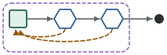 [`ralph-loop`](ralph-loop/README.md) | `20260922-052016` | 4 | yes: e-plan-check-fail, e-tests-fail; caught by plan-check, tests | stop node done | $2.52 | 51 | 4 | exact (3, 5, 8, 11, 14) | **fail** (1) |
| 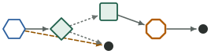 [`patrol-pulse`](patrol-pulse/README.md) | `20260922-050527` | – | none | halt at prioritise | $1.31 | 22 | 2 | no count kept | pass |
| 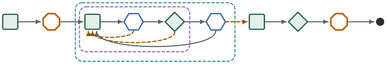 [`gauntlet-decomposed`](gauntlet-decomposed/README.md) | `20260922-151855` | 1 | yes: e-next-piece-pass; caught by ? | stop human | $6.95 | 35 | 0 | no count kept | **fail** (10) |
| 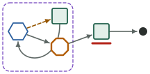 [`merge-queue`](merge-queue/README.md) | `20260922-051355` | 1 | yes: e-bisect-integrate; caught by integrate | halt at land-gate | $1.09 | 21 | 1 | exact (2, 3) | pass |

**Two paid, two are findings.** [`patrol-pulse`](patrol-pulse/README.md) filed exactly the one ticket due, cross-referenced the fault already on file and touched nothing else, halting at its gate; [`merge-queue`](merge-queue/README.md) failed its integration at round 0 by construction, bisected to the one breaking patch, integrated green at round 1 and halted with nothing landed. Both bets paid in full.

[`ralph-loop`](ralph-loop/README.md) turned both its back edges — `e-plan-check-fail` three times (one plan item per pass) and `e-tests-fail` once, on the round where the held-out acceptance cases of the item just ticked pinned what the previous item left open — and finished all four items in five passes with exact dispatch counts and the first `ending` line on record. It is red on one line: the fix-round builder ran `cat` on the held-out case file it was told not to read. The rule was an instruction, never a permission; on this tier and with a failing assertion in front of it, the instruction did not hold.

[`gauntlet-decomposed`](gauntlet-decomposed/README.md) is red for a reason in the template: its planner, told to write each piece's "cut of the reference", transcribed the reference into `PIECES.md` down to literal SVG elements and a nine-value palette, under the heading "copy them exactly; owners do not see the reference". The owner then matched the reference through the plan and both piece critics passed at round 0 — the critic's own report says the two captures "cannot be told apart" — so `e-critic-fail` never fired. The run then halted on the outer loop's `human every 2` stop before the integrator, correctly, because the planner cut three pieces where the pre-registration expected two. **A planner that may copy the reference into the owner's document defeats the held-out mechanism from inside the graph**; the write-up names the one-sentence fix and this record is kept as it is (decision 0009).

**Spend:** $11.87 for five invocations of four runs ([`ledger.json`](ledger.json), invocations 27–31; `gauntlet-decomposed` is a kickoff plus the scripted resume); **$57.51 of the $75.00 cap** in all, $17.49 left.

## All twenty

One kept run per template (`run/`; for `review-gate`, `spec-then-loop`, `specialist-critic-bank` and `fresh-grind-rare-judge` the re-proved one). Dispatch count is the lead's own tally on its loop notes against the started lines and check runs before each; "no count kept" means the loop's budget is in minutes, or the lead kept none.

| Template | Batch | Back edge taken, caught by | Denials | Dispatch count | `--check` |
|---|---|---|---|---|---|
| 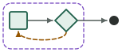 [`contradiction-seeker`](contradiction-seeker/README.md) | first | none | 8 | no count kept | pass |
| 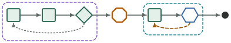 [`debate-then-build`](debate-then-build/README.md) | second | none | 1 | exact (3) | pass |
|  [`dual-bar`](dual-bar/README.md) | second | none | 2 | exact (2) | pass |
| 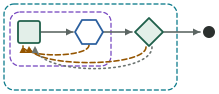 [`fresh-grind-rare-judge`](fresh-grind-rare-judge/README.md) | second (re-proved after 0012) | yes: e-judge-next-phase; caught by judge (next-phase) | 3 | exact (3, 6) | pass |
|  [`gauntlet-decomposed`](gauntlet-decomposed/README.md) | prior art (0017) | yes: e-next-piece-pass; caught by ? | 0 | no count kept | **fail** (10) |
| 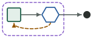 [`grind-loop`](grind-loop/README.md) | first | none | 3 | no count kept | pass |
| 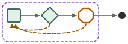 [`heterogeneous-critic`](heterogeneous-critic/README.md) | second | yes: e-critic-fail; caught by critic (fail) | 9 | exact (2, 4) | pass |
|  [`human-gated-irreversible`](human-gated-irreversible/README.md) | second | none | 1 | no count kept | pass |
|  [`merge-queue`](merge-queue/README.md) | prior art (0017) | yes: e-bisect-integrate; caught by integrate | 1 | exact (2, 3) | pass |
| 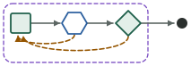 [`metric-sandwich`](metric-sandwich/README.md) | first | none | 4 | no count kept | pass |
| 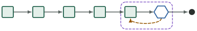 [`ownership-not-swarm`](ownership-not-swarm/README.md) | second | none | 2 | no count kept | pass |
|  [`patrol-pulse`](patrol-pulse/README.md) | prior art (0017) | none | 2 | no count kept | pass |
|  [`ralph-loop`](ralph-loop/README.md) | prior art (0017) | yes: e-plan-check-fail, e-tests-fail; caught by plan-check, tests | 4 | exact (3, 5, 8, 11, 14) | **fail** (1) |
|  [`red-team-loop`](red-team-loop/README.md) | second | none | 2 | exact (2) | pass |
| 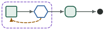 [`retrospective-rewrite`](retrospective-rewrite/README.md) | second | none | 2 | no count kept | pass |
|  [`review-gate`](review-gate/README.md) | first (re-proved after 0010) | none | 2 | no count kept | pass |
| 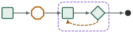 [`spec-then-loop`](spec-then-loop/README.md) | first (re-proved after 0010) | none | 14 | exact (2) | pass |
| 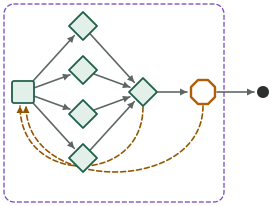 [`specialist-critic-bank`](specialist-critic-bank/README.md) | second (re-proved after 0012) | none | 0 | exact (6) | pass |
|  [`taste-polish`](taste-polish/README.md) | second | yes: e-critic-fail; caught by critic (fail) | 7 | exact (3, 6) | pass |
| 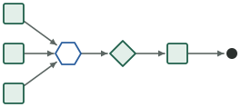 [`tournament-then-judge`](tournament-then-judge/README.md) | second | none | 0 | no count kept | pass |

## What the prior-art batch showed

- **Three of four loops turned, and two of the three turns were the task's doing.** `ralph-loop`'s plan check returned the builder after every item and its tests check caught the hidden interaction the plan planted; `merge-queue`'s integration check caught the batch it could not pass. `gauntlet-decomposed`'s inner loop did not turn, for a reason inside the graph. `patrol-pulse` has no loop by design and is the only template in the library whose output is a record rather than a change.
- **A planner can leak the answer key.** The one design fault found here is not a brief that is too thin but one that is too generous: `gauntlet-decomposed` asks its planner to write each piece's cut of the reference, and a frontier planner writes that cut as the reference itself. Held-out evidence protects against a builder that reads it; nothing protected against a node inside the graph that copies it.
- **"Not yours to read" held three times out of four and failed once.** The `ralph-loop` fix-round builder `cat`ed the held-out case file when handed a failing assertion it could not otherwise explain; `gauntlet-decomposed`'s owner and integrator did not, and neither did batch two's builders. The runner allows reads there by rule for the whole session, so the instruction is the only brake, and it is a soft one.
- **The `ending` line arrived.** `ralph-loop`'s lead wrote `{"at":"graph","outcome":"ending"}` before its final note, the first record on which the slice-0014 marker appears; the three gate-halted runs correctly have none, since a halt is not a final note at `graph`.
- **The blind A/B appeared as written.** `gauntlet-decomposed`'s critic reported two captures as A and B with labels stripped and said which was better ("neither") before listing gaps — the slice-0014 brief wording reaching a record for the first time. No node in these four declares `skills`, so preloading was not exercised.
- **Denials fell again**: 0, 1, 2 and 4, a median of 1.5, and the four in `ralph-loop` are all note-append plumbing. `git add` and `git commit` were allowed for this batch so the ralph builder could commit on green, which it did five times.

## What the second batch showed

- **Four loops looped.** `heterogeneous-critic` and `taste-polish` failed round 0 on held-out evidence the builder never saw and passed at round 1; `fresh-grind-rare-judge` took `next-phase` back to the builder; `specialist-critic-bank`'s triage sent the builder back once and would have again. Every one of them was caught by the node the template puts there to catch it. The first batch had none.
- **Two bets did not pay.** A strong builder given a precise CSV contract produced a parser a frontier red team could not break with a 400,000-input differential fuzz (`red-team-loop`), and a fast builder passed all 43 held-out evaluator cases at its first phase-2 attempt (`fresh-grind-rare-judge`). Both write-ups say so; both records still show the mechanism working on the critic's side.
- **Held-out evidence works by instruction, not by permission.** The runner allows `Read` on the held-out folder by rule for the whole session; the digest is what shows who used it. In all three held-out runs the critic or judge ran the cases and the builder never touched them, though its path stood in a file the builder was given.
- **Two records fail `--check` for true reasons.** In `fresh-grind-rare-judge` the lead amended the working copy to give the judge `run-tests` and, since the compiled agent file could not change, dispatched a `general-purpose` stand-in as the phase-2 judge; in `specialist-critic-bank` the lead halted on the $6.00 session ceiling the ledger imposes, a stop the graph does not have, and miscounted dispatches (8 a round for 6). Both are findings for the template and the brief, not retries. Slice 0012 fixed what they exposed; both were re-proved green on 2026-09-21 (above).
- **Dispatch counts were exact in seven of eight loops that kept one**, checks included; the eighth is the miscount above, which the new check caught.
- **Denials fell from 2 and 14 in the re-proved runs to a median of 2 (0–9) here, and no `cd … &&` or `git -C` form appears in any of the 32.** What remains is note-append plumbing (`printf`, heredocs, shell variables) and, in the two costliest cases, a git idiom for the diff of new files (`git add -N`, brace groups) and attempts to rasterise an SVG.
- **Two harness quirks.** With subagents dispatched in parallel, `claude -p --output-format json` reported 4 turns and 28 s for a 335 s run and 11 turns and 111 s for a 496 s one (`duration_api_ms` was right both times). And a lead can see its `--max-budget-usd` position: the bank's lead halted at $5.51 of $6.00 rather than start a round it could not finish.

## What the first batch showed

- **No run needed a second round.** Every builder passed at its first attempt. In `review-gate` and `metric-sandwich` the builder read the checklist in the repository (it is not among their declared inputs), so the items meant to stay open were closed before judging. In `contradiction-seeker` the builder fixed the planted defect because the claim is one of its inputs. The critics confirmed; none caught.
- **The critics used the repository where they had it.** The `metric-sandwich` critic searched the whole tree for stale wording, a check a diff-only critic cannot make. The `spec-then-loop` critic, which has no repository access, returned `invalid-evidence` on an answer-key line that pointed at an unchanged file.
- **Both gate runs waited without a halt note.** Each lead asked in its final reply, where LEAD.md §7 wants an `outcome: "halt"` note in a session that cannot ask.
- **The record is weaker than the work.** Note timestamps were estimated (some out of order with the transcripts). The four leads with a turn budget counted turns differently: 2, 4 (worker dispatches), 16 and 19, against 18 to 45 harness turns. Run ids were typed by hand after the random draw was refused: `k7qm` in three of five runs, as in both earlier runs on record.
